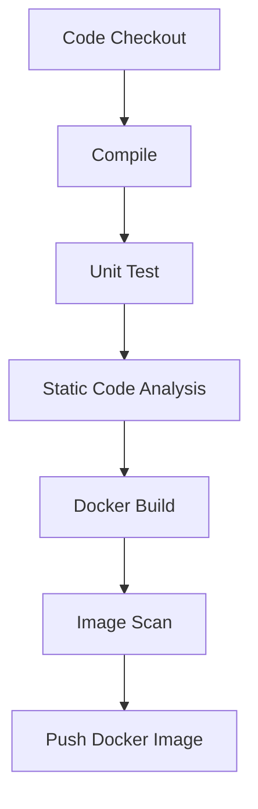
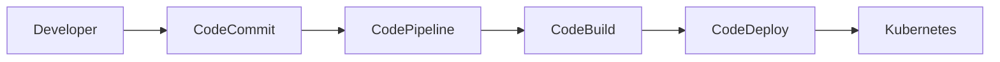
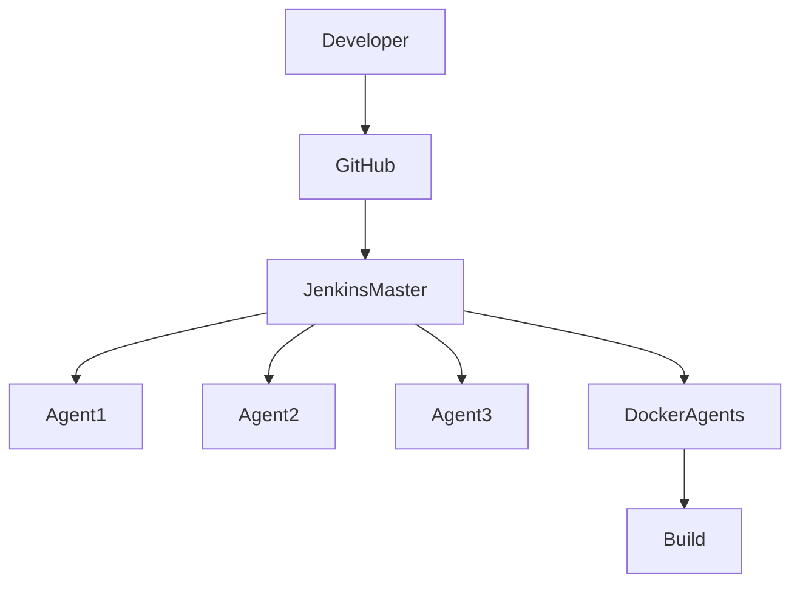

# Day 13 – AWS CodePipeline | Jenkins vs AWS CodePipeline | Open Source vs AWS Managed

> **Topic:** Understanding AWS CodePipeline by comparing it with Jenkins and learning when organizations prefer AWS Managed CI/CD services over Open Source solutions.

---

# Table of Contents

1. Introduction
2. AWS Developer Tools Overview
3. Traditional CI/CD using Jenkins
4. AWS CI/CD using CodePipeline
5. Jenkins vs AWS CodePipeline Mapping
6. Continuous Integration vs Continuous Delivery
7. Why Organizations Choose AWS Managed Services
8. Why Jenkins is Still Popular
9. Advantages & Disadvantages Comparison
10. Interview Questions
11. Key Takeaways

---

# Introduction

AWS provides a complete suite of services for implementing **Continuous Integration (CI)** and **Continuous Delivery (CD)**.

The four primary AWS Developer Tools are:

| AWS Service      | Purpose                |
| ---------------- | ---------------------- |
| AWS CodeCommit   | Source Code Repository |
| AWS CodePipeline | Pipeline Orchestrator  |
| AWS CodeBuild    | Build & Test           |
| AWS CodeDeploy   | Deployment             |

These four services together form the AWS-native CI/CD ecosystem.

---

# AWS CI/CD Services Overview

```text
                AWS CI/CD Suite

        +--------------------------+
        |     CodeCommit           |
        | Source Code Repository   |
        +------------+-------------+
                     |
                     v
        +--------------------------+
        |    CodePipeline          |
        | Pipeline Orchestrator    |
        +------------+-------------+
                     |
                     v
        +--------------------------+
        |     CodeBuild            |
        | Build + Test + Package   |
        +------------+-------------+
                     |
                     v
        +--------------------------+
        |     CodeDeploy           |
        | Deploy Application       |
        +--------------------------+
```

---

# Traditional CI/CD Using Jenkins

## Workflow


---

## Step-by-Step Explanation

### Step 1

Developer commits code to GitHub.

```
Developer
     |
     | Git Commit
     v
 GitHub Repository
```

---

### Step 2

GitHub triggers Jenkins using a **Webhook**.

```
GitHub
    |
Webhook
    |
    v
 Jenkins Pipeline
```

---

### Step 3

Jenkins executes Continuous Integration.

Typical stages include:

```text
Source Checkout
        │
        ▼
Build
        │
        ▼
Unit Testing
        │
        ▼
Static Code Analysis
        │
        ▼
Docker Build
        │
        ▼
Docker Image Scanning
        │
        ▼
Push Image to Registry
```

These stages may vary depending on:

* Java applications
* Python applications
* ML projects
* Mobile applications
* Web applications

---

### Step 4

Once CI is completed,

Jenkins triggers the Continuous Delivery system.

Possible deployment tools:

* ArgoCD ✅ (Recommended)
* FluxCD
* Spinnaker
* Helm
* Shell Scripts
* Ansible (Older approach)

---

# Important Note

Jenkins mainly excels in **Continuous Integration**.

Although Jenkins **can perform deployments**, modern DevOps architecture generally prefers:

```
Jenkins
      |
      v
GitOps Tool
      |
      v
Kubernetes
```

instead of

```
Jenkins
      |
Shell Script
      |
      v
Kubernetes
```

---

# Continuous Integration Pipeline



---

# Why GitOps?

GitOps tools continuously monitor Kubernetes.

If someone changes resources manually,

GitOps automatically restores them to the desired state stored in Git.

```
Git Repository
      │
      ▼
 ArgoCD / FluxCD
      │
      ▼
 Kubernetes

Manual Changes
      │
      ▼
Automatically Reverted
```

This provides:

* Desired State Management
* Self-Healing
* Declarative Infrastructure
* Version Control

---

# AWS CI/CD Workflow

AWS replaces every major component of Jenkins architecture with managed services.



---

# AWS Workflow Explained

## Step 1

Developer commits code.

```
Developer
      │
      ▼
AWS CodeCommit
```

CodeCommit is AWS's managed Git repository.

---

## Step 2

CodeCommit triggers CodePipeline.

```
CodeCommit
      │
      ▼
CodePipeline
```

---

## Step 3

CodePipeline invokes CodeBuild.

```
CodePipeline
        │
        ▼
CodeBuild
```

CodeBuild performs:

* Source checkout
* Build
* Unit tests
* Static analysis
* Docker build
* Image scanning
* Docker push

---

## Step 4

CodePipeline invokes CodeDeploy.

```
CodePipeline
        │
        ▼
CodeDeploy
        │
        ▼
Deployment Target
```

Deployment targets include:

* EC2
* ECS
* EKS
* Kubernetes
* Lambda

---

# Jenkins vs AWS CodePipeline Mapping

| Traditional         | AWS Equivalent |
| ------------------- | -------------- |
| GitHub              | CodeCommit     |
| Jenkins             | CodePipeline   |
| Jenkins Build Stage | CodeBuild      |
| Deployment Tool     | CodeDeploy     |

---

## Visual Mapping

```text
Traditional

Developer
      |
      ▼
 GitHub
      |
      ▼
 Jenkins
      |
      ▼
 Build + Test
      |
      ▼
 ArgoCD
      |
      ▼
 Kubernetes
```

↓

```text
AWS

Developer
      |
      ▼
 CodeCommit
      |
      ▼
 CodePipeline
      |
      ▼
 CodeBuild
      |
      ▼
 CodeDeploy
      |
      ▼
 Kubernetes
```

---

# Important Difference

## Jenkins

Implements CI directly.

```
Jenkins
      │
      ▼
Continuous Integration
```

---

## AWS

CodePipeline mainly orchestrates.

Actual CI work happens inside CodeBuild.

```
CodePipeline
        │
        ▼
CodeBuild
        │
        ▼
Continuous Integration
```

---

# Why Pay for AWS CodePipeline?

A common interview question.

If Jenkins is free,

Why pay for AWS services?

---

## Jenkins Infrastructure

A typical Jenkins setup requires:

```text
Master Node

      │
      ├──────── Worker 1
      ├──────── Worker 2
      ├──────── Worker 3
      ├──────── Worker 4
      └──────── Worker N
```

As pipelines increase,

More workers are required.

---

## DevOps Team Responsibilities

Someone has to manage:

* Virtual Machines
* Scaling
* Security patches
* Monitoring
* Storage
* Networking
* Backups
* Jenkins upgrades
* Plugin updates
* Worker health

This operational effort is significant.

---

# AWS Managed Services Philosophy

AWS removes operational burden.

Instead of managing infrastructure,

you simply consume the service.

AWS manages:

* Scaling
* High Availability
* Reliability
* Security
* Maintenance
* Upgrades

You only pay based on usage.

---

# Why Startups Prefer AWS Managed Services

Many startups:

* Have small DevOps teams
* Want faster delivery
* Don't want infrastructure maintenance

Therefore,

they prefer:

```
AWS Managed Services
```

instead of

```
Self-hosted Jenkins
```

---

# Why Jenkins is Still Popular

Despite AWS services,

Jenkins remains one of the most widely used CI/CD platforms.

Reasons include:

---

## 1. Open Source

No licensing cost.

Huge community.

Thousands of plugins.

---

## 2. Cloud Independent

Jenkins works on:

* AWS
* Azure
* Google Cloud
* On-Premises
* Hybrid Cloud

AWS CodePipeline primarily targets AWS.

---

## 3. Easy Migration

Suppose organization moves from AWS to Azure.

With Jenkins:

```
Backup Jenkins

↓

Launch Jenkins on Azure

↓

Restore Backup

↓

Continue Working
```

Very little pipeline modification is needed.

---

With CodePipeline,

AWS-specific configurations may require redesign.

---

## 4. Rich Plugin Ecosystem

Jenkins integrates with almost every DevOps tool.

Examples:

* GitHub
* GitLab
* Bitbucket
* SonarQube
* Docker
* Kubernetes
* Nexus
* JFrog
* Slack
* Teams
* Terraform
* Ansible

---

# Cost Consideration

AWS Managed Services are **Pay-As-You-Go**.

If resources are left running unnecessarily,

costs increase.

Efficient monitoring is important.

---

# AWS Managed Services Limitation

```text
AWS CodePipeline
       │
       ▼
AWS Ecosystem
```

Very tightly integrated with AWS.

Moving to another cloud may require:

* Pipeline redesign
* Service replacement
* Reconfiguration

---

# Jenkins Architecture Example



Modern Jenkins often uses **Docker Agents**.

Benefits:

* Containers created only during builds
* Automatically destroyed afterward
* Better resource utilization
* Reduced infrastructure cost

---

# Jenkins vs AWS CodePipeline

| Feature           | Jenkins            | AWS CodePipeline         |
| ----------------- | ------------------ | ------------------------ |
| Cost              | Free (Open Source) | Pay-as-you-go            |
| Infrastructure    | Self-managed       | AWS Managed              |
| Scaling           | User Managed       | AWS Managed              |
| Maintenance       | User               | AWS                      |
| Plugins           | Thousands          | Limited AWS Integrations |
| Multi-cloud       | Excellent          | Limited                  |
| AWS Integration   | Good               | Excellent                |
| Learning Curve    | Moderate           | Easy if using AWS        |
| Vendor Lock-in    | No                 | Yes                      |
| Community Support | Huge               | AWS Documentation        |

---

# When Should You Choose Jenkins?

Choose Jenkins when:

* Multi-cloud support is required
* Organization already uses Jenkins
* Custom plugins are needed
* Infrastructure management is acceptable
* Cost optimization is important

---

# When Should You Choose AWS CodePipeline?

Choose CodePipeline when:

* Entire infrastructure is on AWS
* Small DevOps team
* Managed services preferred
* High availability is desired
* Operational overhead should be minimized

---

# Interview Questions

## Q1. What is AWS CodePipeline?

**Answer:**

AWS CodePipeline is a fully managed Continuous Integration and Continuous Delivery orchestration service that automates software release workflows by integrating services like CodeCommit, CodeBuild, and CodeDeploy.

---

## Q2. Difference between Jenkins and CodePipeline?

| Jenkins      | CodePipeline   |
| ------------ | -------------- |
| Open Source  | AWS Managed    |
| Self Hosted  | Managed by AWS |
| Multi-cloud  | AWS Focused    |
| Plugin Based | AWS Integrated |

---

## Q3. Why is Jenkins still popular?

* Free
* Mature ecosystem
* Multi-cloud support
* Thousands of plugins
* No vendor lock-in

---

## Q4. Why do companies use CodePipeline?

* No infrastructure maintenance
* Automatic scaling
* High availability
* Native AWS integration
* Faster setup

---

## Q5. Why isn't CodeCommit widely used?

Many organizations prefer:

* GitHub
* GitLab
* Bitbucket

because they offer richer collaboration features and are cloud-agnostic, even when using AWS CodePipeline and CodeBuild.

---

# Key Takeaways

* AWS provides four major CI/CD services: **CodeCommit**, **CodePipeline**, **CodeBuild**, and **CodeDeploy**.
* **CodePipeline** acts as the orchestrator in AWS-native CI/CD workflows.
* **CodeBuild** performs the Continuous Integration tasks such as building, testing, and packaging.
* **CodeDeploy** handles application deployment to supported targets.
* Jenkins remains a dominant CI tool due to its flexibility, open-source ecosystem, and cloud independence.
* AWS Managed Services reduce operational overhead by handling infrastructure, scaling, maintenance, and availability.
* Organizations choose between Jenkins and AWS CodePipeline based on factors such as team size, cloud strategy, operational complexity, cost, and the need to avoid vendor lock-in.
* A common real-world pattern is to use **GitHub** as the source repository together with **AWS CodePipeline**, **CodeBuild**, and **CodeDeploy**, rather than relying on CodeCommit.
