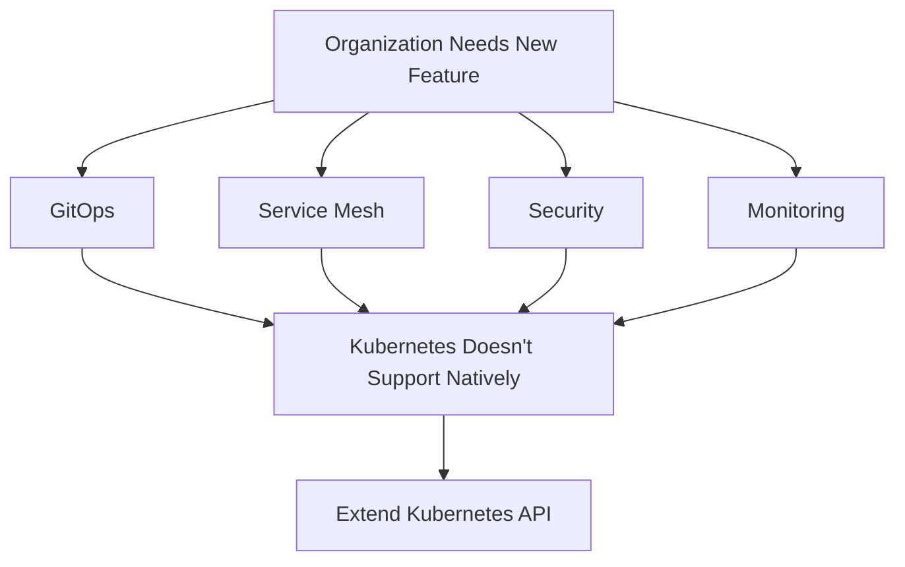
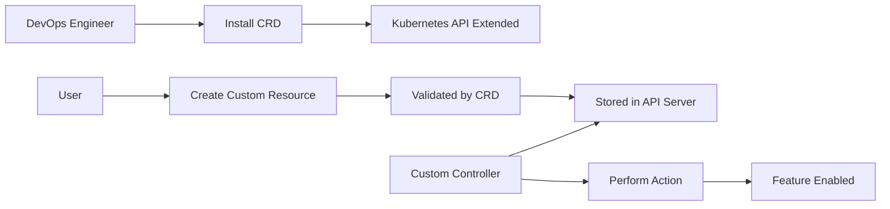
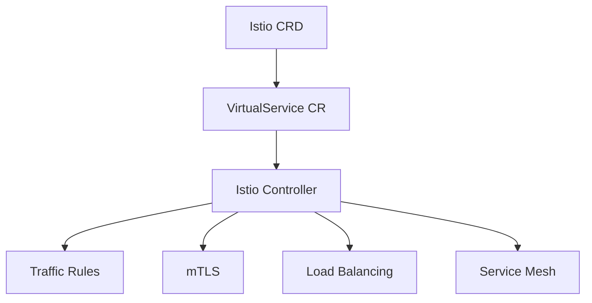
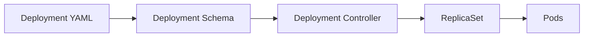
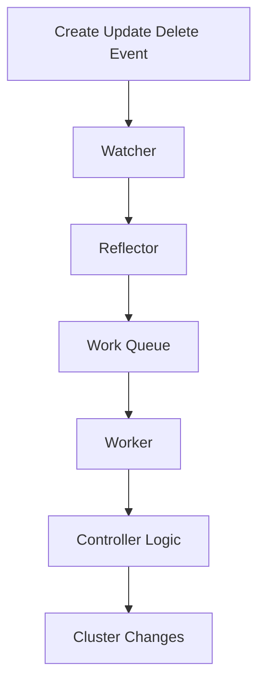

# Day 40: Kubernetes Custom Resources, Custom Resource Definitions (CRDs) & Custom Controllers

## Deep Dive Notes

> **Goal:** Understand how Kubernetes can be extended beyond its native resources using **Custom Resource Definitions (CRDs)**, **Custom Resources (CRs)**, and **Custom Controllers**.

---

# Table of Contents

1. Introduction
2. Why Kubernetes Needs Custom Resources
3. Native Kubernetes Resources vs Custom Resources
4. Custom Resource Definition (CRD)
5. Custom Resource (CR)
6. Custom Controller
7. Complete Architecture Flow
8. Real-World Example: Istio
9. CRD vs CR vs Controller Comparison
10. How Custom Controllers Work Internally
11. Writing Your Own Custom Controller
12. DevOps Engineer Responsibilities
13. CNCF Ecosystem & Custom Controllers
14. Key Interview Questions
15. Summary

---

# 1. Introduction

Kubernetes comes with many built-in resources:

* Pod
* Deployment
* Service
* ConfigMap
* Secret
* Ingress
* StatefulSet
* DaemonSet

These are called **Native Kubernetes Resources**.

However, modern organizations need much more functionality:

* Service Mesh
* GitOps
* Security Policies
* API Gateways
* IAM Solutions
* Monitoring Systems

Kubernetes cannot natively implement every feature requested by every company.

Therefore, Kubernetes provides a mechanism to **extend its API**.

This mechanism is built using:

```text
1. CRD (Custom Resource Definition)
2. CR (Custom Resource)
3. Custom Controller
```

---

# 2. Why Kubernetes Needs Custom Resources

Imagine your Kubernetes cluster already has:

```text
Deployment
Service
Ingress
ConfigMap
Secret
```

Everything works perfectly.

Now your organization wants:

* GitOps → ArgoCD
* Service Mesh → Istio
* Security Policies → Kyverno
* Monitoring → Prometheus
* Multi-cluster Management → Crossplane

Kubernetes developers cannot continuously modify Kubernetes core for every new tool.

Instead Kubernetes says:

> "You can extend my API yourself."

---

## Problem Statement



---

# 3. Native Resources vs Custom Resources

## Native Resource Example

Deployment YAML

```yaml
apiVersion: apps/v1
kind: Deployment

metadata:
  name: nginx

spec:
  replicas: 3
```

Kubernetes already understands:

```text
Deployment
ReplicaSet
Pod
```

because their definitions already exist internally.

---

## Custom Resource Example

Istio introduces:

```yaml
apiVersion: networking.istio.io/v1alpha3

kind: VirtualService

metadata:
  name: my-service
```

Question:

How does Kubernetes know what a VirtualService is?

Answer:

**Through a CRD.**

---

# 4. Custom Resource Definition (CRD)

## What is a CRD?

A CRD is a Kubernetes object that:

### Defines

* New API Type
* New Resource Kind
* Schema
* Validation Rules

### Purpose

It tells Kubernetes:

> "A new resource called VirtualService exists."

---

## Simple Definition

```text
CRD = Blueprint
```

or

```text
CRD = Resource Definition
```

---

## CRD Responsibilities

### 1. Extends Kubernetes API

Adds new resource types.

Example:

```text
VirtualService
DestinationRule
Certificate
Application
```

---

### 2. Validates Resources

Checks:

```text
Is YAML structure correct?
Are mandatory fields present?
Are data types correct?
```

---

## Diagram

```text
             +----------------------+
             |   Custom Resource    |
             +----------+-----------+
                        |
                        v
             +----------------------+
             |         CRD          |
             | Validation Rules     |
             | API Definition       |
             +----------------------+
```

---

# 5. Custom Resource (CR)

## What is a CR?

A Custom Resource is:

> An instance created using a CRD.

---

### Think of it Like

| Component             | Equivalent    |
| --------------------- | ------------- |
| CRD                   | Class         |
| CR                    | Object        |
| Deployment Definition | Native Class  |
| Deployment YAML       | Native Object |

---

## Example

### CRD

Defines:

```text
VirtualService
```

---

### CR

User creates:

```yaml
apiVersion: networking.istio.io/v1alpha3

kind: VirtualService

metadata:
  name: my-app

spec:
  hosts:
  - app.example.com
```

This is a Custom Resource.

---

# 6. Custom Controller

Now comes the most important piece.

---

## Problem

Suppose:

```text
CRD Installed ✔
CR Created ✔
```

What next?

Nothing happens!

Why?

Because nobody is watching the resource.

---

## Example

Creating an Ingress without an Ingress Controller:

```text
Ingress Resource Created
↓
No Controller
↓
No Traffic Routing
```

Same thing happens here.

---

## Solution

A Custom Controller must watch the CR.

---

## Definition

A Custom Controller:

> Watches custom resources and performs actions whenever they are created, updated, or deleted.

---

## Controller Responsibilities

```text
Watch
Validate
Reconcile
Take Action
```

---

# 7. Complete Architecture Flow

## End-to-End Flow



---

# Visual Workflow

```text
STEP 1
------
Install CRD

        DevOps Engineer
                |
                v

     +------------------+
     |       CRD        |
     +------------------+


STEP 2
------
User Creates CR

        User
          |
          v

     +------------------+
     | Custom Resource  |
     +------------------+


STEP 3
------
Validation

CR ---> CRD ---> Valid


STEP 4
------
Controller Watches Resource

     +----------------------+
     | Custom Controller    |
     +-----------+----------+
                 |
                 v

         Execute Logic
```

---

# 8. Real-World Example: Istio

Istio introduces several resources:

```text
VirtualService
DestinationRule
Gateway
Sidecar
```

These resources do not exist in native Kubernetes.

---

## What Happens?

### DevOps Engineer

Installs:

```text
1. Istio CRDs
2. Istio Controllers
```

---

### User

Creates:

```yaml
kind: VirtualService
```

---

### Istio Controller

Reads the VirtualService.

Then configures:

```text
Traffic Routing
Load Balancing
Service Mesh
mTLS
East-West Traffic
```

---

## Architecture



---

# 9. CRD vs CR vs Controller

| Feature              | CRD                       | CR                  | Controller       |
| -------------------- | ------------------------- | ------------------- | ---------------- |
| Purpose              | Define Resource           | Create Resource     | Execute Logic    |
| Created By           | Tool Vendor               | User                | Tool Vendor      |
| Example              | VirtualService Definition | VirtualService YAML | Istio Controller |
| Stored In API Server | Yes                       | Yes                 | Runs as Pod      |
| Performs Actions     | No                        | No                  | Yes              |
| Validation           | Yes                       | No                  | No               |

---

# 10. How Kubernetes Handles Native Resources

Let's compare with Deployments.

---

## Native Flow



---

## Custom Resource Flow


---

# 11. Internal Working of Custom Controllers

Custom Controllers continuously watch Kubernetes events.

---

## Events

```text
Create
Update
Delete
```

Whenever one of these happens:

```text
Watcher detects event
↓
Event added to Queue
↓
Worker processes Queue
↓
Controller executes logic
```

---

## Internal Diagram



---

# 12. Writing Your Own Custom Controller

Most controllers are written using:

## Golang

Why?

### Kubernetes Itself Is Written in Go

Benefits:

* Fast
* Lightweight
* Concurrency Support
* Excellent Kubernetes Libraries

---

## Popular Libraries

### client-go

Used to interact with Kubernetes API.

```text
Custom Controller
       |
       v

    client-go
       |
       v

 Kubernetes API Server
```

---

### controller-runtime

Modern framework for controller development.

Provides:

```text
Watchers
Reconciliation
Queues
Manager
Caching
```

---

### Operator SDK

Used for building:

```text
Kubernetes Operators
```

which are advanced controllers.

---

# 13. CNCF Ecosystem and Custom Controllers

Most CNCF projects are built using:

```text
CRDs
Controllers
Operators
```

---

## Popular Examples

| Project             | Purpose                |
| ------------------- | ---------------------- |
| Istio               | Service Mesh           |
| ArgoCD              | GitOps                 |
| Prometheus Operator | Monitoring             |
| Crossplane          | Multi-Cloud            |
| Kyverno             | Security Policies      |
| Cert Manager        | Certificate Management |
| Backstage           | Developer Portal       |

---

## CNCF Landscape

```text
CNCF
│
├── Istio
├── ArgoCD
├── Prometheus
├── Crossplane
├── Kyverno
├── Cert-Manager
└── Many More...
```

All of them heavily rely on:

```text
CRDs + Controllers
```

---

# 14. DevOps Engineer Responsibilities

Most DevOps engineers do NOT write controllers.

Their responsibilities are:

---

## Installation

Install:

```text
CRDs
Controllers
Operators
```

using:

```text
Helm
kubectl
Operator Framework
```

---

## Operations

Monitor:

```text
Controller Health
Logs
Status
Events
```

---

## Troubleshooting

Example:

```text
VirtualService Not Working
```

Check:

```text
kubectl get virtualservice

kubectl describe virtualservice

kubectl logs <controller-pod>
```

---

## Knowledge Expectations

For tools like Istio:

Understand:

* VirtualService
* DestinationRule
* Gateway
* Envoy Proxy
* mTLS
* Traffic Routing

Not necessarily:

* Istio source code

---

# 15. Example Installation Flow (Istio)

```text
Step 1
-------
Add Helm Repository

helm repo add istio ...

Step 2
-------
Install CRDs

helm install istio-base ...

Step 3
-------
Install Controllers

helm install istiod ...

Step 4
-------
Users Create VirtualServices

kubectl apply -f virtualservice.yaml

Step 5
-------
Istio Controller Processes Resource
```

---

# Interview Questions

### Q1. What is a CRD?

A CRD (Custom Resource Definition) extends Kubernetes API by introducing new resource types.

---

### Q2. What is a Custom Resource?

An instance created using a CRD.

---

### Q3. Why do we need a Custom Controller?

Because CRDs only define resources; controllers perform the actual actions.

---

### Q4. What happens if a CRD exists but no controller exists?

The resource gets created successfully but no action is performed.

---

### Q5. Name some projects that use CRDs.

* Istio
* ArgoCD
* Prometheus Operator
* Crossplane
* Cert Manager
* Kyverno

---

### Q6. Which language is commonly used to write Kubernetes controllers?

**Golang (Go)**

---

# Final Summary

```text
CRD
↓
Defines a new Kubernetes resource.

CR
↓
User creates an instance of that resource.

Custom Controller
↓
Watches the resource and performs actions.
```

---

## The Golden Formula

```text
Native Kubernetes Resource
=
Resource Definition
+
Resource
+
Native Controller


Custom Kubernetes Resource
=
CRD
+
CR
+
Custom Controller
```

### Remember:

> **CRD extends Kubernetes.**
>
> **CR uses the extension.**
>
> **Controller brings the extension to life.**

This is the fundamental architecture behind modern Kubernetes platforms such as **Istio, ArgoCD, Prometheus Operator, Crossplane, Kyverno, Cert-Manager, and many other CNCF projects.** 🚀
