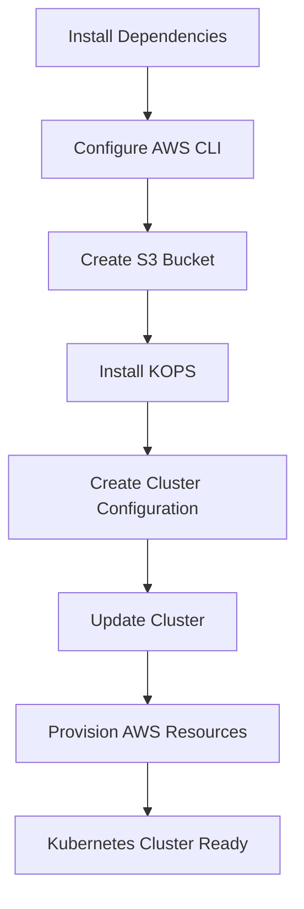

# Day 32 — Managing Hundreds of Kubernetes Clusters in Production with KOPS

> **Key Takeaway:**
> Learning Kubernetes with Minikube, Kind, K3s, or MicroK8s is excellent for development and experimentation. However, real-world DevOps and Cloud Engineers manage **production-grade Kubernetes clusters** using enterprise-ready Kubernetes distributions and lifecycle management tools such as **KOPS (Kubernetes Operations)**.

---

# Table of Contents

1. Why Production Kubernetes is Different
2. Development vs Production Kubernetes
3. What is a Kubernetes Distribution?
4. Popular Kubernetes Distributions
5. Kubernetes vs EKS
6. Challenges of Managing Kubernetes in Production
7. Introduction to KOPS
8. Why KOPS Became Popular
9. Kubernetes Cluster Lifecycle Management
10. KOPS Architecture
11. KOPS Installation Workflow
12. AWS Prerequisites
13. Creating a Kubernetes Cluster Using KOPS
14. Production Best Practices
15. Interview Questions & Answers
16. Summary

---

# 1. Why Production Kubernetes is Different

Many learners practice Kubernetes using:

* Minikube
* Kind
* K3s
* K3D
* MicroK8s

These tools are designed primarily for:

✅ Learning Kubernetes

✅ Local Development

✅ Testing Applications

❌ Not intended for large-scale production environments

Production environments require:

* High Availability (HA)
* Cluster upgrades
* Security patching
* Monitoring
* Backup strategies
* Disaster recovery
* Multi-node architecture
* Enterprise support

---

# 2. Development vs Production Kubernetes

## Comparison Chart

| Feature                 | Development Cluster | Production Cluster |
| ----------------------- | ------------------- | ------------------ |
| Minikube                | ✅                   | ❌                  |
| Kind                    | ✅                   | ❌                  |
| K3s                     | ✅                   | ⚠️ Limited         |
| MicroK8s                | ✅                   | ⚠️ Limited         |
| Kubernetes (Full Setup) | ⚠️                  | ✅                  |
| OpenShift               | ⚠️                  | ✅                  |
| Rancher                 | ⚠️                  | ✅                  |
| EKS                     | ⚠️                  | ✅                  |

---

## Architecture Comparison

### Development Environment

```text
+-------------------+
| Developer Laptop  |
+-------------------+
         |
         v
+-------------------+
| Minikube / Kind   |
| Single Node       |
+-------------------+
```

### Production Environment

```text
                    +----------------+
                    | Load Balancer  |
                    +-------+--------+
                            |
                            v
      +--------------------------------------+
      | Kubernetes Control Plane (HA)        |
      +--------------------------------------+
         |                |               |
         v                v               v

+------------+   +------------+   +------------+
| Worker-1   |   | Worker-2   |   | Worker-N   |
+------------+   +------------+   +------------+

         |
         v

+--------------------------+
| Persistent Storage       |
| EBS / EFS / NFS / CSI    |
+--------------------------+
```

---

# 3. What is a Kubernetes Distribution?

A **distribution** is a customized version of an open-source project.

## Linux Example

```text
Linux Kernel
     |
     +--> Ubuntu
     |
     +--> Red Hat
     |
     +--> CentOS
     |
     +--> Amazon Linux
```

These distributions add:

* Enterprise support
* Security updates
* Additional tools
* Better user experience

---

## Kubernetes Example

```text
Kubernetes
     |
     +--> OpenShift
     |
     +--> Rancher
     |
     +--> VMware Tanzu
     |
     +--> Amazon EKS
     |
     +--> AKS
     |
     +--> GKE
```

All of them are based on Kubernetes.

They mainly provide:

* Easier management
* Enterprise support
* Additional automation
* Better operational experience

---

# 4. Popular Kubernetes Distributions

## Industry Adoption Order (as discussed)

```text
1. Kubernetes (Self Managed)
2. OpenShift
3. Rancher
4. VMware Tanzu
5. Amazon EKS
6. Azure AKS
7. Google GKE
8. Docker Kubernetes Engine
```

---

## Distribution Comparison

| Distribution | Provider     |
| ------------ | ------------ |
| Kubernetes   | CNCF         |
| OpenShift    | Red Hat      |
| Rancher      | Rancher Labs |
| Tanzu        | VMware       |
| EKS          | AWS          |
| AKS          | Azure        |
| GKE          | Google Cloud |

---

# 5. Kubernetes vs EKS

This is a very common interview question.

## Self-Managed Kubernetes

```text
AWS EC2
   |
   v
Install Kubernetes Yourself
   |
   v
You Manage Everything
```

Responsibilities:

* Installation
* Upgrades
* Maintenance
* Troubleshooting
* Security

---

## EKS

```text
AWS
   |
   v
Managed Kubernetes Service
   |
   v
AWS Handles Control Plane
```

Benefits:

* AWS Support
* Managed upgrades
* Managed control plane
* Easier operations

---

## Visual Comparison

```text
Self Managed Kubernetes

You
 |
 +--> Install
 +--> Upgrade
 +--> Backup
 +--> Monitor
 +--> Troubleshoot


EKS

AWS
 |
 +--> Control Plane

You
 |
 +--> Applications
 +--> Worker Nodes
```

---

# 6. Challenges of Managing Kubernetes in Production

Imagine:

```text
100 Teams
  |
  +--> 10,000 Developers
  |
  +--> Hundreds of Clusters
```

Managing manually becomes difficult.

Tasks include:

* Cluster creation
* Cluster updates
* Scaling
* Configuration changes
* Security patching
* Cluster deletion

This entire process is called:

# Kubernetes Lifecycle Management

---

# 7. Introduction to KOPS

## What is KOPS?

**KOPS = Kubernetes Operations**

A tool designed for:

* Creating clusters
* Updating clusters
* Managing configurations
* Upgrading Kubernetes versions
* Deleting clusters

---

## Why KOPS?

Because DevOps engineers need more than installation.

They need lifecycle management.

```text
Cluster Lifecycle

Create
   |
   v
Configure
   |
   v
Upgrade
   |
   v
Scale
   |
   v
Delete
```

KOPS handles all these operations.

---

# 8. Why KOPS Became Popular

Earlier:

```text
Kubeadm
```

was heavily used.

But Kubeadm required many manual steps.

---

## Kubeadm vs KOPS

| Feature           | Kubeadm | KOPS         |
| ----------------- | ------- | ------------ |
| Installation      | Manual  | Automated    |
| Upgrades          | Complex | Easier       |
| Scaling           | Manual  | Easier       |
| Cluster Lifecycle | Limited | Excellent    |
| Production Usage  | Good    | Very Popular |

---

# 9. Kubernetes Cluster Lifecycle Management

A DevOps Engineer's responsibilities:

```text
+----------------------+
| Create Cluster       |
+----------------------+

+----------------------+
| Upgrade Cluster      |
+----------------------+

+----------------------+
| Modify Configuration |
+----------------------+

+----------------------+
| Scale Cluster        |
+----------------------+

+----------------------+
| Delete Cluster       |
+----------------------+
```

KOPS simplifies all these tasks.

---

# 10. KOPS Architecture

```text
                    +-------------------+
                    | AWS Account       |
                    +---------+---------+
                              |
                              v

                    +-------------------+
                    | S3 State Store    |
                    +---------+---------+
                              |
                              v

                    +-------------------+
                    | KOPS              |
                    +---------+---------+
                              |
                              v

             +-------------------------------+
             | Kubernetes Cluster            |
             +-------------------------------+
```

---

## Why S3?

KOPS stores:

* Cluster configuration
* Metadata
* State information

inside an S3 bucket.

```text
S3 Bucket
   |
   +--> Cluster Config
   +--> State Files
   +--> Cluster Metadata
```

---

# 11. KOPS Installation Workflow



---

# 12. AWS Prerequisites

## Required Tools

### Python 3

Used by AWS CLI.

### AWS CLI

Used to communicate with AWS services.

### kubectl

Used to interact with Kubernetes clusters.

---

## AWS Permissions Required

If using an IAM user:

```text
EC2 Full Access
S3 Full Access
IAM Full Access
VPC Full Access
```

If using an Administrator account:

```text
Already Included
```

---

## AWS CLI Configuration

```bash
aws configure
```

Provide:

```text
AWS Access Key ID
AWS Secret Access Key
Region
Output Format
```

---

# 13. Creating a Kubernetes Cluster Using KOPS

## Step 1: Install KOPS

```bash
kops version
```

Verify installation.

---

## Step 2: Create S3 Bucket

```bash
aws s3 mb s3://kops-state-store
```

Example:

```bash
aws s3 mb s3://kops-ab-storage1
```

---

## Step 3: Create Cluster

Typical command:

```bash
kops create cluster \
--name=k8s.local \
--state=s3://kops-ab-storage1 \
--zones=us-east-1a \
--node-count=2 \
--node-size=t2.micro \
--master-size=t2.micro
```

---

## Cluster Creation Process

```text
KOPS Command
      |
      v
Creates Cluster Configuration
      |
      v
Stores Config in S3
      |
      v
Generates Infrastructure Plan
```

At this stage:

✅ Configuration exists

❌ Infrastructure not yet provisioned

---

## Step 4: Apply Configuration

```bash
kops update cluster --yes
```

This command:

```text
Creates EC2 Instances
Creates Security Groups
Creates VPC Components
Creates EBS Volumes
Creates Kubernetes Components
```

---

## Final Flow

```text
Create S3 Bucket
       |
       v
Create Cluster Config
       |
       v
Store State in S3
       |
       v
Apply Configuration
       |
       v
Provision Infrastructure
       |
       v
Kubernetes Cluster Ready
```

---

# 14. Production Best Practices

## Use Real Domain Names

Development:

```text
k8s.local
```

Production:

```text
company.com
dev.company.com
prod.company.com
```

---

## Route 53 Integration

```text
Route53
    |
    v
Hosted Zone
    |
    v
Cluster Domain
```

Example:

```text
dev.company.com
prod.company.com
```

---

## Production Recommendation

```text
Development
   |
   +--> Minikube

Testing
   |
   +--> KOPS Cluster

Production
   |
   +--> KOPS
   +--> EKS
   +--> OpenShift
```

---

# 15. Interview Questions & Answers

---

## Q1. What is KOPS?

**Answer:**

KOPS (Kubernetes Operations) is a Kubernetes cluster lifecycle management tool used to create, upgrade, scale, configure, and delete production-grade Kubernetes clusters.

---

## Q2. Why is KOPS preferred over Kubeadm?

**Answer:**

KOPS provides better lifecycle management, easier upgrades, scaling support, and automated infrastructure provisioning.

---

## Q3. Why does KOPS require S3?

**Answer:**

KOPS uses S3 as a state store to maintain cluster configuration and metadata.

---

## Q4. What is the difference between Kubernetes and EKS?

**Answer:**

Self-managed Kubernetes requires administrators to handle installation, upgrades, and maintenance, whereas EKS is a managed Kubernetes service where AWS manages the control plane and provides enterprise support.

---

## Q5. Can Minikube be used in production?

**Answer:**

No. Minikube is intended for local development and learning purposes.

---

## Q6. What is Kubernetes Lifecycle Management?

**Answer:**

It refers to the complete management of a cluster including creation, configuration, upgrades, scaling, maintenance, and deletion.

---

# 16. Summary

## Key Learnings

✅ Minikube, Kind, K3s, and MicroK8s are primarily development tools.

✅ Production environments use enterprise Kubernetes distributions.

✅ Popular distributions include Kubernetes, OpenShift, Rancher, Tanzu, EKS, AKS, and GKE.

✅ KOPS is a Kubernetes lifecycle management tool.

✅ KOPS simplifies cluster creation, upgrades, scaling, and deletion.

✅ S3 acts as the state store for KOPS.

✅ AWS CLI, Python, and kubectl are required prerequisites.

✅ Production clusters commonly use real domains integrated with Route 53.

✅ Understanding KOPS and production Kubernetes management is highly valuable for DevOps and Cloud Engineer interviews.

---

# One-Line Interview Summary

> **"KOPS is a Kubernetes Operations tool used to manage the complete lifecycle of production Kubernetes clusters—including creation, upgrades, scaling, configuration changes, and deletion—while storing cluster state in an S3 backend."** 🚀
