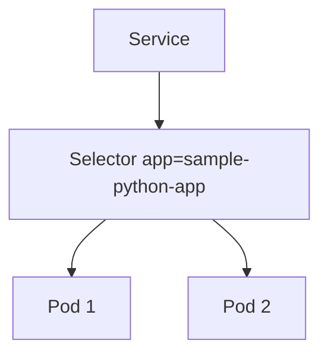
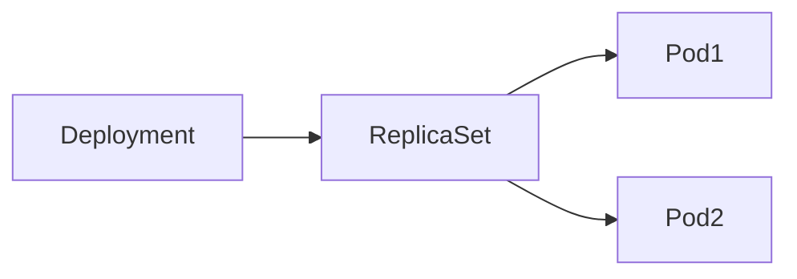
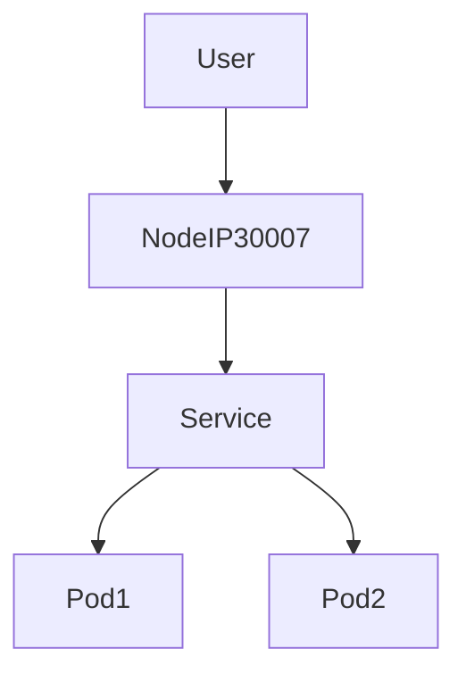
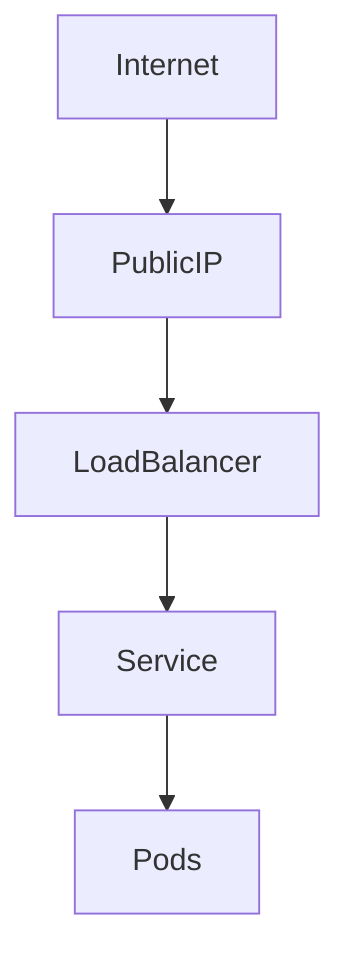
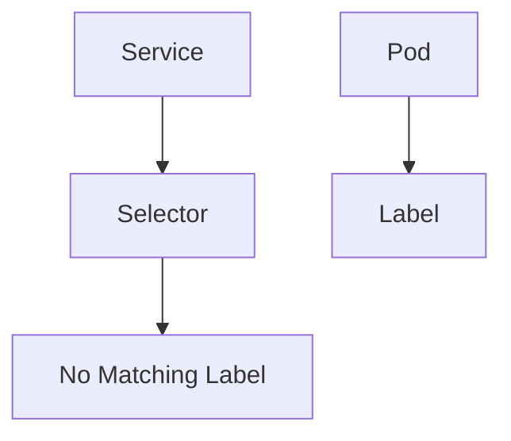
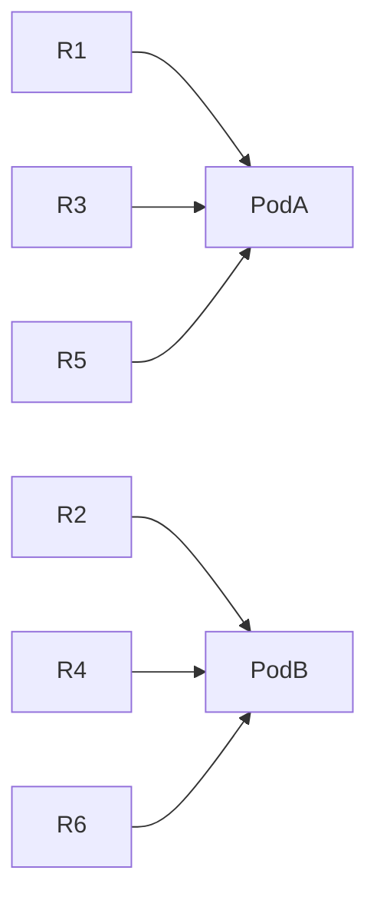
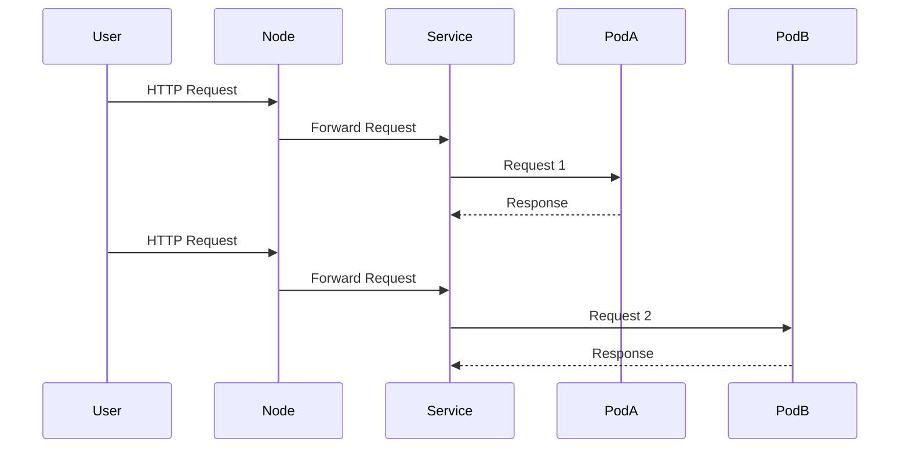
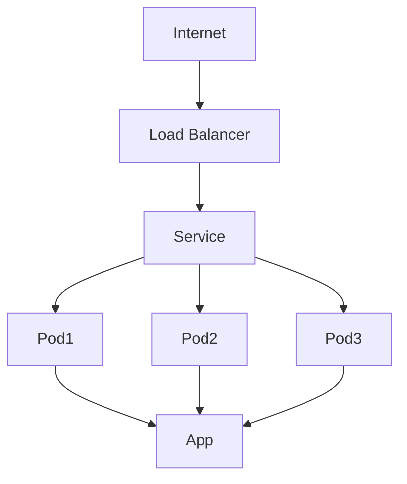

# 🚀 Day 37 – Kubernetes Services Deep Dive (Practical + Kubeshark Traffic Analysis)

> **Goal:** Understand Kubernetes Services through hands-on demonstrations, traffic visualization using Kubeshark, service discovery, load balancing, and application exposure mechanisms.

---

# 📚 Learning Objectives

By the end of this session, you will understand:

✅ Why Kubernetes Services are required

✅ Problems with direct Pod access

✅ Service Discovery using Labels & Selectors

✅ Internal and External Application Exposure

✅ NodePort vs LoadBalancer Services

✅ Service-based Load Balancing

✅ Traffic Flow Visualization using Kubeshark

---

# 🏗️ Architecture Overview

```text
                    User Request
                          │
                          ▼
                 Kubernetes Service
                          │
         ┌────────────────┴───────────────┐
         │                                │
         ▼                                ▼
      Pod-1                           Pod-2
  (172.17.0.5)                   (172.17.0.7)
```

The Service acts as a stable entry point and distributes traffic across Pods.

---

# 🔥 The Core Problem with Pods

Pods receive **dynamic IP addresses**.

Example:

```text
Before Pod Restart

Pod-A → 172.17.0.6

After Restart

Pod-A → 172.17.0.7
```

If clients directly connect to Pod IPs:

```text
Client → 172.17.0.6 ❌ (No longer exists)
```

Result:

* Traffic loss
* Application downtime
* Broken communication

---

# ✅ Solution: Kubernetes Services

A Service provides:

| Feature              | Purpose               |
| -------------------- | --------------------- |
| Service Discovery    | Find Pods dynamically |
| Load Balancing       | Distribute requests   |
| Application Exposure | Make apps accessible  |

---

# 🧠 Service Discovery Using Labels & Selectors

Instead of tracking Pod IPs, Kubernetes tracks Pods using Labels.

---

## Pod Labels

```yaml
metadata:
  labels:
    app: sample-python-app
```

---

## Service Selector

```yaml
selector:
  app: sample-python-app
```

---

# How Service Discovery Works

```text
Service
   │
   ▼
Selector:
app=sample-python-app
   │
   ▼
Find all Pods with:
app=sample-python-app
```

---

# Service Discovery Flow



Whenever a new Pod is created:

```text
New Pod
app=sample-python-app
```

The Service automatically discovers it.

No IP changes need to be tracked.

---

# 🐍 Deploying the Sample Application

A Python Django application was used.

---

## Deployment Configuration

```yaml
apiVersion: apps/v1
kind: Deployment

metadata:
  name: sample-python-app

spec:
  replicas: 2

  selector:
    matchLabels:
      app: sample-python-app

  template:
    metadata:
      labels:
        app: sample-python-app

    spec:
      containers:
      - name: python-app
        image: python-sample-app-demo:v1

        ports:
        - containerPort: 8000
```

---

# Deployment Workflow



---

# ReplicaSet Self-Healing Demonstration

Initial state:

```text
Pod1
Pod2
```

Delete one Pod:

```bash
kubectl delete pod pod1
```

ReplicaSet automatically creates:

```text
Pod2
Pod3 (new)
```

---

# Why Pod IPs Are Unreliable

```text
Old Pod

172.17.0.6
```

Deleted

↓

```text
New Pod

172.17.0.7
```

Clients using old IP fail.

Hence:

```text
Never rely on Pod IPs.
Always use Services.
```

---

# 🌐 Accessing Pods Directly

Inside the cluster:

```bash
curl http://172.17.0.5:8000/demo
```

Works.

Outside cluster:

```bash
curl http://172.17.0.5:8000/demo
```

Fails.

Reason:

Pods only have Cluster Network visibility.

---

# Kubernetes Networking Layers

```text
Internet
   │
   ▼
Node IP
   │
   ▼
Service
   │
   ▼
Pod IP
```

---

# 📡 Exposing Applications Using NodePort

NodePort exposes applications through worker node IPs.

---

## NodePort Service YAML

```yaml
apiVersion: v1
kind: Service

metadata:
  name: python-django-service

spec:
  type: NodePort

  selector:
    app: sample-python-app

  ports:
  - port: 80
    targetPort: 8000
    nodePort: 30007
```

---

# NodePort Traffic Flow



---

# Example

Node IP:

```text
192.168.64.10
```

NodePort:

```text
30007
```

Access URL:

```text
http://192.168.64.10:30007/demo
```

---

# Internal Organization Access

```text
Employees
      │
      ▼
Node IP
      │
      ▼
Application
```

Useful for:

* Internal tools
* Company portals
* Monitoring dashboards

---

# 🌍 Exposing Applications to the Outside World

NodePort is insufficient for public internet traffic.

Use:

```yaml
type: LoadBalancer
```

---

# LoadBalancer Architecture



---

# LoadBalancer Service

```yaml
spec:
  type: LoadBalancer
```

---

# Cloud Controller Manager's Role

When Kubernetes sees:

```yaml
type: LoadBalancer
```

Cloud Controller Manager:

```text
AWS CCM
Azure CCM
GCP CCM
```

Creates:

```text
Public IP Address
```

Automatically.

---

# Example

```text
External IP:

34.201.10.15
```

Users can access:

```text
http://34.201.10.15
```

From anywhere in the world.

---

# ⚠️ Why LoadBalancer Doesn't Work in Minikube

Minikube is local.

No cloud provider exists to create:

```text
Public IP
```

Hence:

```text
EXTERNAL-IP = Pending
```

---

# Alternative for Minikube

Use:

```text
MetalLB
```

MetalLB provides LoadBalancer support in local clusters.

---

# 🔍 Service Discovery Failure Demonstration

Original selector:

```yaml
selector:
  app: sample-python-app
```

Changed selector:

```yaml
selector:
  app: sample-python-ap
```

(Missing one character)

---

# Result

Service cannot find Pods.

```text
Service
   │
   ▼
No Matching Pods Found
```

Application becomes unreachable.

---

# Discovery Failure Diagram



---

# Lesson

Labels and selectors must match exactly.

---

# ⚖️ Kubernetes Service Load Balancing

Deployment replicas:

```yaml
replicas: 2
```

Pods:

```text
Pod-A → 172.17.0.5

Pod-B → 172.17.0.7
```

---

# Service Load Balancing Flow

```text
Request 1 → Pod-A

Request 2 → Pod-B

Request 3 → Pod-A

Request 4 → Pod-B
```

---

# Round Robin Visualization



---

# 🦈 Kubeshark Introduction

Kubeshark is a Kubernetes traffic analyzer.

Think of it as:

```text
Wireshark for Kubernetes
```

---

# What Kubeshark Provides

✅ Request tracing

✅ Service maps

✅ Layer 4 visibility

✅ Layer 7 visibility

✅ HTTP inspection

✅ TCP inspection

✅ Traffic replay

✅ Packet capture

---

# Installation

Linux:

```bash
curl -Ls https://kubeshark.co/install | sh
```

Mac:

```bash
brew install kubeshark
```

---

# Start Kubeshark

```bash
kubeshark tap -A
```

`-A` means:

```text
All Namespaces
```

---

# Kubeshark Access

```text
http://localhost:8899
```

---

# Traffic Visualization Example

User executes:

```bash
curl http://192.168.64.10:30007/demo
```

Traffic path:

```text
Laptop
   │
   ▼
Minikube Node
   │
   ▼
Service
   │
   ├────► Pod-A
   │
   └────► Pod-B
```

---

# Packet Journey



---

# Kubeshark Load Balancing Observation

Six requests generated:

```text
1 → Pod-A

2 → Pod-B

3 → Pod-A

4 → Pod-B

5 → Pod-A

6 → Pod-B
```

Proof that Kubernetes Service performs:

```text
Load Balancing
```

Across available Pods.

---

# 🎯 Complete Service Architecture



---

# 💡 Key Interview Questions

### Q1. Why do we need Kubernetes Services?

**Answer:**

To provide:

* Stable networking
* Service discovery
* Load balancing
* Application exposure

---

### Q2. Why shouldn't applications use Pod IPs directly?

**Answer:**

Pod IPs are dynamic and change whenever Pods are recreated.

---

### Q3. How does Service Discovery work?

**Answer:**

Using Labels and Selectors.

---

### Q4. Difference between NodePort and LoadBalancer?

| NodePort                  | LoadBalancer        |
| ------------------------- | ------------------- |
| Internal/Organization use | Public Internet     |
| Uses Node IP              | Uses Public IP      |
| Manual access             | Cloud-managed       |
| No external LB            | Creates external LB |

---

### Q5. How does Kubernetes Service perform load balancing?

**Answer:**

The Service distributes requests across matching Pods using kube-proxy networking rules.

---

# 🏆 Final Takeaways

### Kubernetes Service Solves Three Critical Problems

```text
1. Service Discovery
2. Load Balancing
3. Application Exposure
```

---

## Golden Rule for Kubernetes Networking

```text
❌ Never access Pods directly.

✅ Always access applications through Services.
```

---

# 📌 Summary Diagram

```text
                Kubernetes Service

        ┌────────────┬─────────────┬─────────────┐
        │            │             │
        ▼            ▼             ▼

 Service      Load Balancing    Application
 Discovery                      Exposure

 Labels &      Traffic          NodePort /
 Selectors     Distribution     LoadBalancer

        │
        ▼

      Pods
```

> **Kubeshark Insight:** The most powerful learning from this session is visually observing how Kubernetes Services discover Pods and distribute traffic in real time. It transforms abstract networking concepts into observable packet flows, making Kubernetes networking much easier to understand and troubleshoot. 🚀
