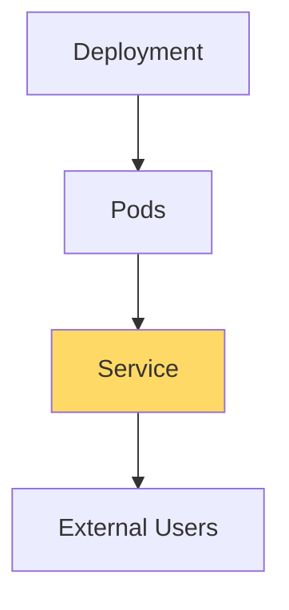
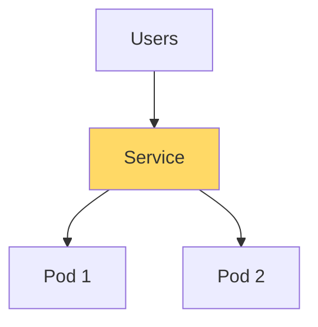
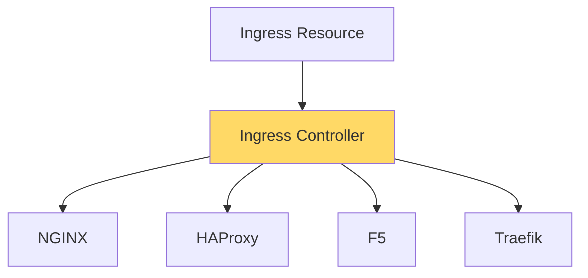
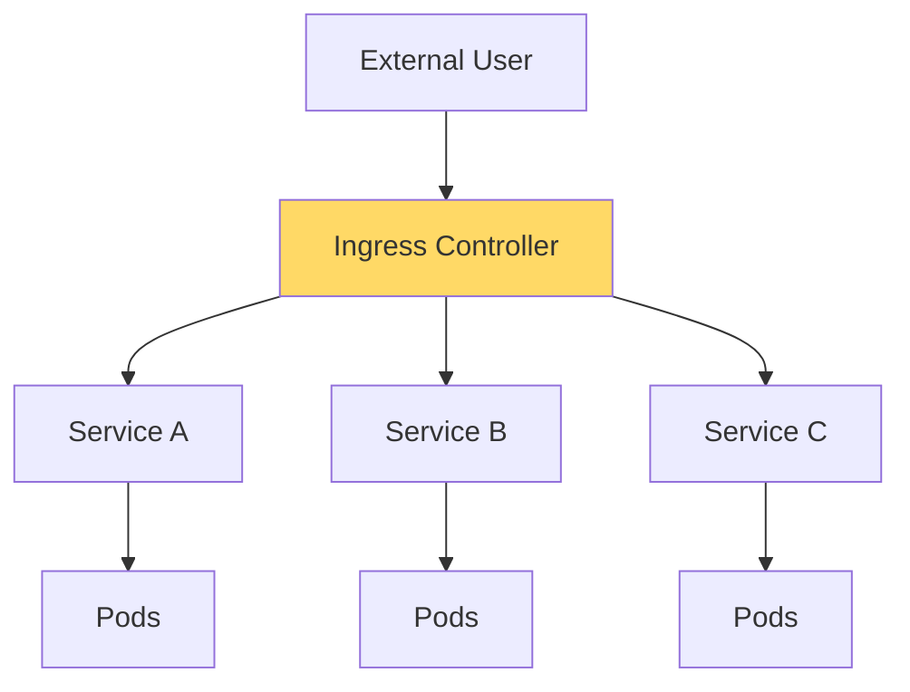
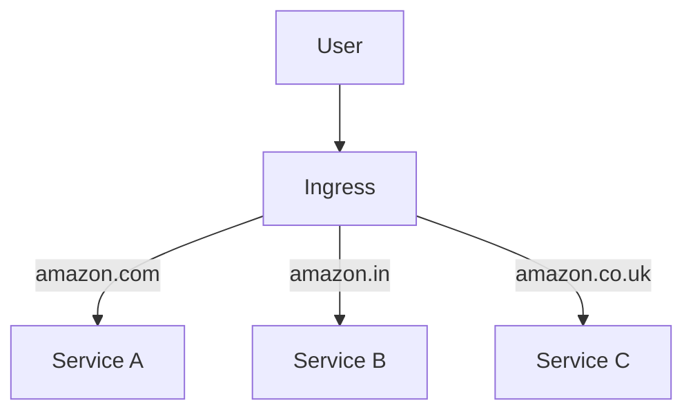
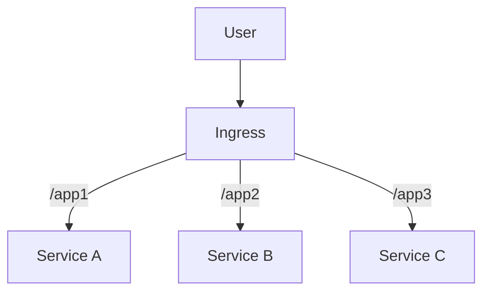
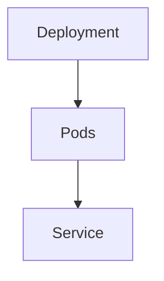
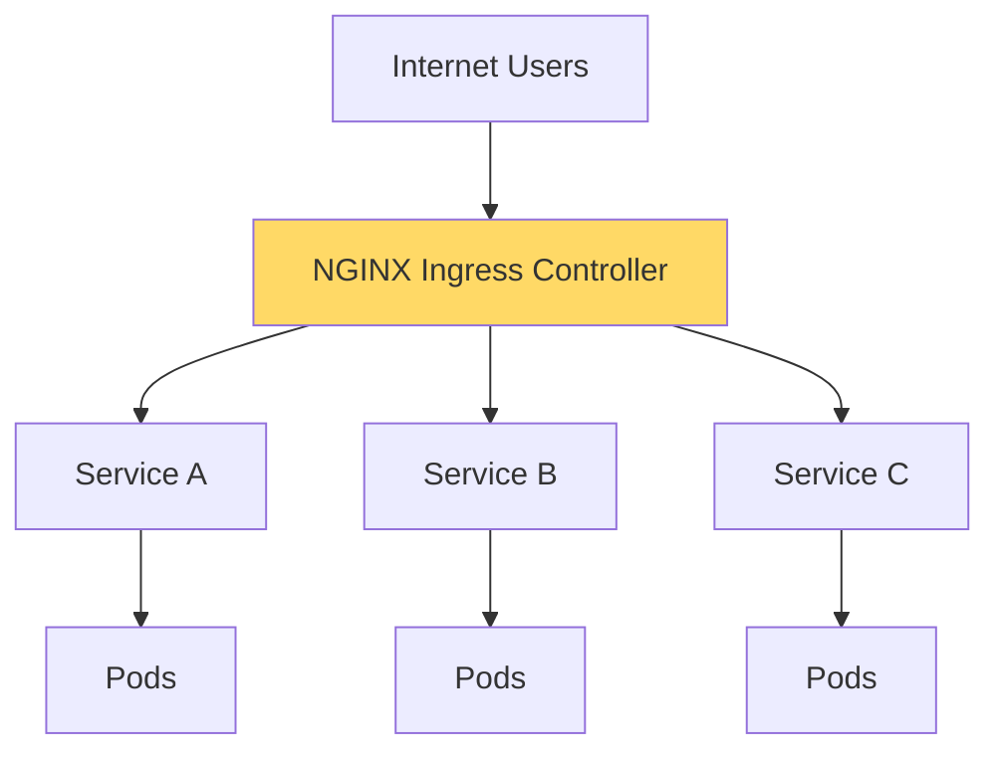

# Day 38 – Kubernetes Ingress (Complete Notes)
> **Goal:** Understand **why Ingress is needed**, **what problems it solves**, **Ingress Controllers**, and **how to configure Ingress practically**.

---

# 1. Introduction to Kubernetes Ingress

Many learners find Kubernetes Ingress difficult because:

1. They do not understand **why Ingress exists**.
2. They face issues while setting it up practically on Minikube or local Kubernetes clusters.

Once you understand the **problem Ingress solves**, the concept becomes very simple.

---

# 2. Before Ingress Existed

Before Kubernetes v1.1 (around late 2015), Kubernetes did **not have Ingress**.

Applications were typically exposed using:

```text
Deployment
     │
     ▼
   Service
     │
     ▼
 External Users
```

---

## Architecture Before Ingress



### What Services Provided

Kubernetes Services offered:

✅ Service Discovery

✅ Load Balancing

✅ Stable Networking

✅ External Exposure (NodePort / LoadBalancer)

---

# 3. Problems with Services Alone

Although Services were useful, organizations migrating from traditional infrastructure discovered major limitations.

---

# Problem 1: Lack of Enterprise Load Balancing Features

Before Kubernetes, applications often ran on:

```text
Virtual Machines
Physical Servers
```

And were fronted by enterprise-grade load balancers such as:

* NGINX
* F5 BIG-IP
* HAProxy
* Traefik
* Others

These load balancers provided advanced capabilities.

---

## Enterprise Load Balancer Features

| Feature                        | Description                           |
| ------------------------------ | ------------------------------------- |
| Path-Based Routing             | Route based on URL path               |
| Host-Based Routing             | Route based on domain                 |
| Sticky Sessions                | Same user always reaches same backend |
| Ratio-Based Routing            | Send X% traffic to one backend        |
| TLS/SSL Termination            | Secure HTTPS traffic                  |
| Whitelisting                   | Allow selected users/IPs              |
| Blacklisting                   | Block selected users/IPs              |
| Web Application Firewall (WAF) | Security against attacks              |
| Advanced Security Rules        | Enterprise-grade traffic control      |

---

### What Kubernetes Service Offered

Kubernetes Service mostly offered:

```text
Round Robin Load Balancing
```

Example:

```text
10 Requests

Request 1 → Pod A
Request 2 → Pod B
Request 3 → Pod A
Request 4 → Pod B
...
```

---

## Diagram: Service Load Balancing



This is simple load balancing.

Organizations wanted much more.

---

# Problem 2: Cloud Cost Explosion

Suppose you expose applications using:

```yaml
type: LoadBalancer
```

Each Service gets:

* Public IP
* Cloud Load Balancer

---

## Small Example

```text
Service A → LoadBalancer → Public IP
Service B → LoadBalancer → Public IP
Service C → LoadBalancer → Public IP
```

---

## Large Enterprise Example

```text
1000 Services
=
1000 Load Balancers
=
1000 Public IPs
=
Huge Cloud Cost
```

Cloud providers charge for these resources.

---

### Traditional Infrastructure

Earlier, organizations used:

```text
One Load Balancer
        │
        ├── App 1
        ├── App 2
        ├── App 3
        └── App N
```

Only one public IP was exposed.

---

### Kubernetes Without Ingress

```text
Service 1 → Public IP
Service 2 → Public IP
Service 3 → Public IP
Service 4 → Public IP
...
```

Very expensive.

---

# Why Kubernetes Introduced Ingress

Kubernetes recognized these challenges and introduced:

```text
Ingress
```

Its objectives:

1. Enterprise-grade routing
2. Reduced cloud costs
3. Better traffic management
4. Secure application exposure

---

# What is Kubernetes Ingress?

Ingress is a Kubernetes resource that defines:

> **How external traffic reaches services inside the cluster.**

It provides:

* Host-based routing
* Path-based routing
* TLS termination
* Centralized traffic management

---

## Important Point

Ingress itself does **not perform routing**.

Ingress only defines rules.

Something else must implement those rules.

---

# Enter the Ingress Controller

This is the most important concept.

---

## Analogy

### Service Resource

```text
Service YAML
      │
      ▼
 kube-proxy
      │
      ▼
 Load Balancing
```

---

### Pod Resource

```text
Pod YAML
      │
      ▼
 kubelet
      │
      ▼
 Pod Creation
```

---

### Ingress Resource

```text
Ingress YAML
      │
      ▼
Ingress Controller
      │
      ▼
Routing Configuration
```

---

# What is an Ingress Controller?

An Ingress Controller:

> Watches Ingress resources and configures a real load balancer accordingly.

---

## Flow



---

# Why Kubernetes Did Not Implement It Directly

There are hundreds of load balancers.

Examples:

* NGINX
* HAProxy
* F5
* Traefik
* Ambassador
* Apache APISIX

Kubernetes cannot maintain logic for all of them.

Therefore Kubernetes said:

```text
We provide Ingress Resource.
Load Balancer vendors provide Controllers.
```

---

# Popular Ingress Controllers

| Controller                 | Description             |
| -------------------------- | ----------------------- |
| NGINX Ingress Controller   | Most popular            |
| HAProxy Ingress Controller | HAProxy-based           |
| Traefik Ingress Controller | Cloud-native routing    |
| Ambassador                 | API Gateway + Ingress   |
| F5 BIG-IP Controller       | Enterprise environments |
| Apache APISIX              | API management          |

---

# Complete Architecture with Ingress



---

# Host-Based Routing

Host-based routing uses domain names.

Example:

```text
amazon.com     → Service A
amazon.in      → Service B
amazon.co.uk   → Service C
```

---

## Diagram



---

# Path-Based Routing

Routing based on URL paths.

Example:

```text
example.com/app1 → Service A

example.com/app2 → Service B

example.com/app3 → Service C
```

---

## Diagram



---

# Interview Question

## Difference Between Service LoadBalancer and Ingress

| Service Type LoadBalancer | Ingress                     |
| ------------------------- | --------------------------- |
| One LB per Service        | One LB for many Services    |
| Higher cost               | Lower cost                  |
| Basic load balancing      | Advanced routing            |
| No host/path routing      | Host/path routing           |
| Limited features          | Enterprise features         |
| Simple setup              | Requires Ingress Controller |

---

# Practical Demonstration

---

## Existing Setup



The application is already accessible through:

```bash
curl <NodeIP>:NodePort
```

Example output:

```text
Learn DevOps with strong foundational knowledge
```

---

# Creating an Ingress Resource

Example YAML:

```yaml
apiVersion: networking.k8s.io/v1
kind: Ingress

metadata:
  name: ingress-example

spec:
  rules:
  - host: foo.bar.com
    http:
      paths:
      - path: /bar
        pathType: Prefix

        backend:
          service:
            name: my-service
            port:
              number: 80
```

---

## What This Means

When user accesses:

```text
foo.bar.com/bar
```

Route traffic to:

```text
my-service:80
```

---

# What Happens If Controller Is Missing?

You can create:

```text
1 Ingress
10 Ingresses
100 Ingresses
```

Nothing happens.

Because:

```text
Ingress Resource
≠
Ingress Controller
```

---

## Diagram

```text
Ingress Resource Created
         │
         ▼
No Controller Present
         │
         ▼
No Routing Happens
```

---

# Installing NGINX Ingress Controller (Minikube)

Very simple:

```bash
minikube addons enable ingress
```

---

## Verify Installation

```bash
kubectl get pods -A | grep nginx
```

Expected:

```text
ingress-nginx-controller Running
```

---

# Check Logs

```bash
kubectl logs -n ingress-nginx <pod-name>
```

Controller should detect:

```text
Ingress synced successfully
```

Meaning:

```text
Ingress Resource Found
+
NGINX Config Updated
+
Routing Ready
```

---

# Checking Ingress

```bash
kubectl get ingress
```

Initially:

```text
ADDRESS: Empty
```

After Controller Installation:

```text
ADDRESS: Populated
```

---

# Local Testing Problem

Domain:

```text
foo.bar.com
```

does not really exist.

DNS cannot resolve it.

---

# Solution: Update /etc/hosts

Example:

```bash
sudo vi /etc/hosts
```

Add:

```text
192.168.64.11 foo.bar.com
```

Where:

```text
192.168.64.11
```

is the Ingress IP.

---

## Result

Now:

```bash
curl http://foo.bar.com/bar
```

works successfully.

---

# Production Scenario

In production:

```text
amazon.com
```

is already a valid domain.

No need to modify:

```text
/etc/hosts
```

DNS will automatically resolve the domain.

---

# TLS/HTTPS with Ingress

Ingress can also provide:

```text
HTTPS
SSL/TLS Termination
Secure Communication
```

Example:

```text
http://example.com
        ↓
https://example.com
```

This is one of the most common production use cases.

---

# Key Takeaways

## Remember These Interview Points

### Why Was Ingress Introduced?

1. Kubernetes Services lacked enterprise-grade load balancing.
2. LoadBalancer Services created high cloud costs.

---

### What Is Ingress?

A Kubernetes resource that defines external access rules.

---

### What Is an Ingress Controller?

A controller that watches Ingress resources and configures a load balancer.

---

### Popular Controllers

* NGINX
* HAProxy
* Traefik
* Ambassador
* F5 BIG-IP

---

### Major Features

✅ Host-Based Routing

✅ Path-Based Routing

✅ TLS/HTTPS

✅ Reduced Cost

✅ Centralized Traffic Management

✅ Enterprise Load Balancing Features

---

# Final Architecture Summary



### One-Line Summary

> **Ingress is Kubernetes' solution for enterprise-grade traffic routing, enabling host-based routing, path-based routing, TLS termination, and reduced cloud costs through a single centralized entry point into the cluster.**
