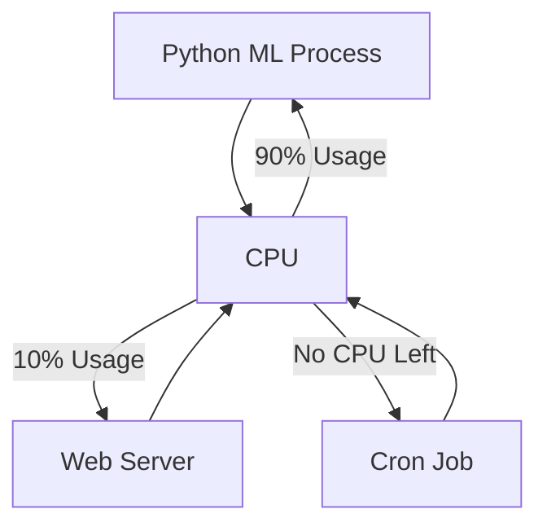
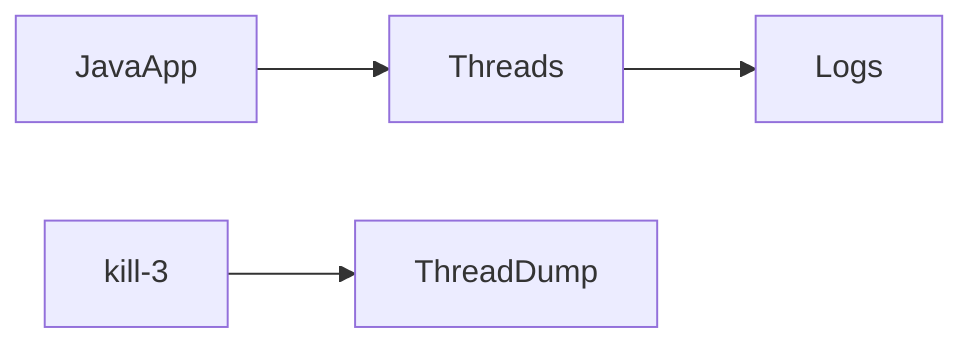
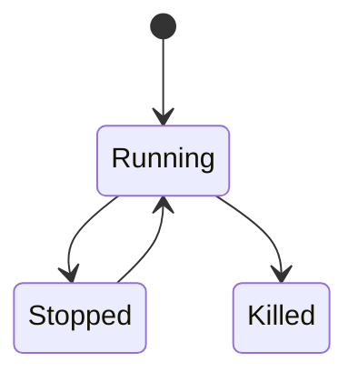
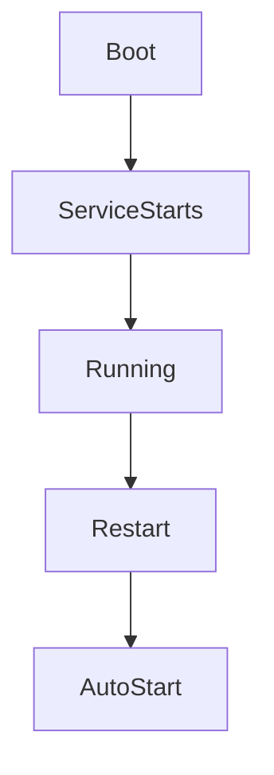
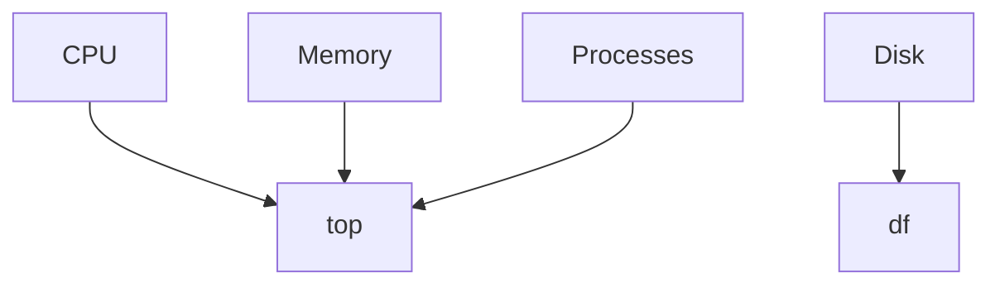
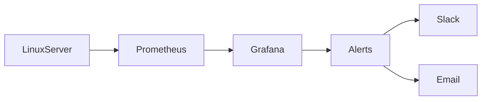
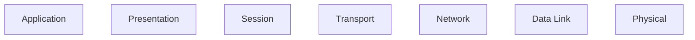
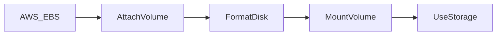
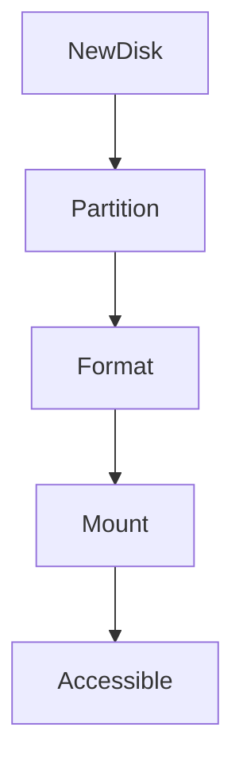
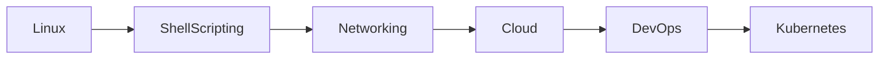

# 🐧 Linux Zero to Hero — Day 5 Learning Notes

## Process Management • Monitoring • Networking • Disk Management

> 🎯 **Instructor:** Abhishek Veeramalla
> 📚 These notes transform the full lesson into structured, interview-ready, revision-friendly documentation with diagrams, charts, and practical command references.

---

# 📌 Table of Contents

1. Process Management
2. Process Lifecycle & CPU Scheduling
3. Viewing Processes
4. Killing / Stopping / Resuming Processes
5. Process Priority (`nice` / `renice`)
6. Linux Services vs Processes
7. Monitoring Linux Systems
8. Networking Fundamentals
9. Disk Management
10. AWS EBS Volume Demo Workflow
11. Important Interview Questions
12. Quick Revision Cheatsheet

---

# 🧠 1. Process Management

## ✅ What is a Process?

A **process** is:

> A running instance of a program.

### Examples

| Program      | Running State |
| ------------ | ------------- |
| Python App   | Process       |
| Shell Script | Process       |
| Java App     | Process       |
| Web Server   | Process       |

---

# ⚙️ How Linux Handles Processes

Applications cannot directly access hardware.

Instead:

```text
Application
    ↓
Operating System
    ↓
CPU / Memory / Disk / Network
```

---

# 🖼️ Process Scheduling Diagram



---

# 💥 Problem Scenario

A CPU-intensive process may:

* consume 90–100% CPU
* block other applications
* slow down the server
* hang the Linux machine

---

# 👨‍💻 Responsibilities of a Linux Administrator

| Task           | Purpose                 |
| -------------- | ----------------------- |
| View Processes | Understand running apps |
| Kill Processes | Remove stuck apps       |
| Stop/Resume    | Temporarily pause       |
| Prioritize     | Allocate CPU importance |

---

# 🔍 2. Viewing Processes

## 📌 Command: `ps`

Shows running processes.

```bash
ps
```

---

## 📌 Show All Processes

```bash
ps aux
```

### Output Columns

| Column  | Meaning          |
| ------- | ---------------- |
| USER    | Process owner    |
| PID     | Process ID       |
| %CPU    | CPU usage        |
| %MEM    | Memory usage     |
| START   | Start time       |
| COMMAND | Executed command |

---

# 📊 Process View Diagram

```text
USER     PID   CPU   MEM   COMMAND
root    2045   2.1   1.0   nginx
ubuntu  3044   9.5   4.0   python app.py
root    4055   0.1   0.2   bash
```

---

# 📌 Count Running Processes

## Method 1

```bash
ps aux | nl
```

## Method 2

```bash
ps aux | wc -l
```

---

# 🆚 `ps aux` vs `ps -ef`

| Feature                 | ps aux | ps -ef |
| ----------------------- | ------ | ------ |
| CPU Usage               | ✅      | ❌      |
| Memory Usage            | ✅      | ❌      |
| Detailed Metrics        | ✅      | ❌      |
| Traditional UNIX Format | ❌      | ✅      |

---

# 🔥 3. Killing Processes

## 📌 Kill a Process

```bash
kill PID
```

Example:

```bash
kill 4055
```

---

# 📌 Find Java Process

```bash
ps aux | grep java
```

---

# 📌 Avoid Showing `grep` Process

```bash
ps aux | grep java | grep -v grep
```

---

# ⚠️ Force Kill a Process

```bash
kill -9 PID
```

Example:

```bash
kill -9 4040
```

---

# 📌 Kill Command Types

| Command     | Purpose              |
| ----------- | -------------------- |
| kill PID    | Graceful termination |
| kill -9 PID | Force kill           |
| kill -3 PID | Thread dump (Java)   |

---

# 🧵 Java Thread Dump



Useful for debugging Java applications.

---

# ⏸️ 4. Stop and Resume Processes

## Stop Process

```bash
kill -STOP PID
```

---

## Resume Process

```bash
kill -CONT PID
```

---

# 🧠 Process States Diagram



---

# 🚦 5. Process Priority (`renice`)

Linux CPU scheduling uses priorities.

---

# 📌 Lower Number = Higher Priority

| Nice Value | Priority |
| ---------- | -------- |
| -20        | Highest  |
| 0          | Default  |
| +19        | Lowest   |

---

## 📌 Change Priority

```bash
renice -n 10 -p PID
```

Lower priority.

---

## 📌 Increase Priority

```bash
renice -n -5 -p PID
```

Higher priority.

---

# 🩺 Doctor Analogy

```text
CPU = Doctor
Processes = Patients

ICU Patient → Higher Priority
Normal Patient → Lower Priority
```

---

# 🔧 6. Services vs Processes

## ✅ Process

Temporary running program.

Examples:

* Python app
* Bash script
* Java application

---

## ✅ Service

Background process that:

* starts automatically during boot
* runs continuously

Examples:

* Nginx
* Apache
* Cron

---

# 🔄 Service Lifecycle



---

# 📌 List Services

```bash
systemctl list-units --type=service
```

---

# 📌 Stop Service

```bash
systemctl stop cron
```

---

# 📌 Start Service

```bash
systemctl start cron
```

---

# 📊 Process vs Service

| Feature                 | Process   | Service |
| ----------------------- | --------- | ------- |
| Runs in background      | Sometimes | Yes     |
| Auto-start after reboot | ❌         | ✅       |
| Long-running            | Optional  | Usually |
| Managed by systemctl    | ❌         | ✅       |

---

# 📈 7. Linux Monitoring

Monitoring helps identify:

* high CPU usage
* memory leaks
* disk issues
* server slowdowns

---

# 🖥️ `top` Command

```bash
top
```

Shows:

* CPU usage
* Memory usage
* Running tasks
* Real-time metrics

---

# 📊 Monitoring Dashboard Concept



---

# 🎨 `htop`

Better visual version of `top`.

```bash
htop
```

Features:

* colorful UI
* process tree
* easy navigation

---

# 📌 Memory Monitoring

## `vmstat`

```bash
vmstat
```

System performance metrics.

---

## `free -h`

```bash
free -h
```

Human-readable memory usage.

---

# 📌 CPU Information

```bash
nproc
```

Shows number of CPUs.

---

# 💽 Disk Usage

## File System Usage

```bash
df -h
```

---

## Folder-wise Disk Usage

```bash
du -sh *
```

---

# 📊 Disk Analysis Example

```text
logs/      2.1GB
scripts/   40MB
python/    500MB
```

---

# ☁️ Modern Monitoring Architecture



---

# 🌐 8. Networking Fundamentals

Networking is foundational for:

* DevOps
* Cloud
* SRE
* Debugging
* Troubleshooting

---

# 📚 Topics Mentioned

| Concept               | Importance                  |
| --------------------- | --------------------------- |
| IP Address            | Device identification       |
| Subnetting            | Network segmentation        |
| Public/Private Subnet | Cloud networking            |
| OSI Model             | Communication layers        |
| Latency               | Performance troubleshooting |

---

# 🧭 OSI Model Diagram



---

# 💾 9. Disk Management

Disk management involves:

* adding storage
* formatting disks
* mounting volumes
* managing partitions

---

# 📦 AWS EBS Storage Flow



---

# 📌 List Block Devices

```bash
lsblk
```

---

# 📌 Detailed Disk Information

```bash
fdisk -l
```

---

# 🧠 Understanding Partitions

```text
8GB Disk
 ├── Root Partition (/)
 ├── Boot Partition (/boot)
 └── Other Partitions
```

---

# 🛠️ 10. Add New Disk Workflow

---

## Step 1 — Create EBS Volume

Example:

* 10 GB
* Same Availability Zone

---

## Step 2 — Attach to EC2

Device name:

```text
/dev/xvdf
```

---

## Step 3 — Verify Disk

```bash
lsblk
```

---

# 📌 Create Mount Directory

```bash
mkdir -p /mnt/demo-volume
```

---

# 📌 Format Disk

```bash
mkfs -t ext4 /dev/xvdf
```

---

# 📌 Mount Volume

```bash
mount /dev/xvdf /mnt/demo-volume
```

---

# 📌 Verify

```bash
df -h
```

---

# 💽 Storage Workflow Diagram



---

# 📌 Important Disk Commands

| Command  | Purpose                 |
| -------- | ----------------------- |
| lsblk    | List block devices      |
| fdisk -l | Detailed partition info |
| mkfs     | Create filesystem       |
| mount    | Attach volume           |
| umount   | Remove mount            |
| df -h    | Disk usage              |
| du -sh   | Folder size             |

---

# 🎯 11. Important Interview Questions

## Process Management

* Difference between process and service?
* Difference between `ps aux` and `ps -ef`?
* Difference between `kill` and `kill -9`?
* What is PID?
* What is `renice`?

---

## Monitoring

* How do you monitor CPU?
* Commands for memory monitoring?
* Difference between `top` and `htop`?
* How do you troubleshoot high CPU?

---

## Disk Management

* What is mounting?
* Difference between block storage and filesystem?
* How to add EBS volume?
* What is `ext4`?

---

# ⚡ 12. Quick Revision Cheatsheet

---

# 🧾 Process Commands

```bash
ps aux
ps -ef
kill PID
kill -9 PID
kill -STOP PID
kill -CONT PID
renice -n 10 -p PID
```

---

# 🧾 Monitoring Commands

```bash
top
htop
free -h
vmstat
nproc
```

---

# 🧾 Disk Commands

```bash
df -h
du -sh *
lsblk
fdisk -l
mkfs -t ext4
mount
umount
```

---

# 🌟 Final Takeaways

✅ Processes are running programs
✅ Services auto-start during boot
✅ Monitoring is essential for troubleshooting
✅ Networking is core to DevOps & Linux
✅ Disk management is critical in cloud environments
✅ Learn Linux + Networking + Shell Scripting together for strong DevOps fundamentals

---

# 🏆 Recommended Learning Path



---

# 🚀 Golden Advice from the Session

> “Linux + Shell Scripting + Networking fundamentals are more than enough to crack most DevOps interviews.”

---

# 📚 Suggested Practice

| Task                     | Goal                     |
| ------------------------ | ------------------------ |
| Run CPU-heavy Python app | Observe process behavior |
| Use `top` and `htop`     | Monitor usage            |
| Add AWS EBS volume       | Practice mounting        |
| Create logs directory    | Analyze disk usage       |
| Stop/start services      | Learn systemctl          |

---

# 🎉 End of Notes

These notes are designed for:

✅ Interview preparation
✅ Revision
✅ Practical Linux administration
✅ DevOps foundations
✅ Real-world troubleshooting
