# OSI Model — Complete Simplified Notes (Networking Fundamentals)

> **Goal:** Understand how data travels from your laptop to a server (like Google) using the **OSI Model**.

---

# Table of Contents

1. Introduction
2. Why OSI Model Exists
3. Real-World Example
4. Two Important Things Before OSI

   * DNS Resolution
   * TCP Handshake
5. OSI Model Overview
6. Detailed Explanation of All 7 Layers
7. End-to-End Data Flow
8. Encapsulation & Decapsulation
9. TCP/IP Model vs OSI Model
10. Important Interview Notes
11. Memory Tricks
12. Summary Tables
13. Practical DevOps Perspective

---

# 1. Introduction

Whenever you:

* Open Google
* Watch YouTube
* Login to Instagram
* Upload files
* Send emails

your data travels through multiple systems across the internet.

The **OSI Model** explains:

* How data travels
* What transformations happen to data
* Which devices are involved
* Which protocols are used

---

# 2. Why OSI Model Exists

The internet is extremely complex.

Without standards:

* Devices from different companies could not communicate
* Routers/switches would behave differently
* Browsers and servers would not understand each other

So networking was divided into **7 logical layers**.

---

# 3. Real-World Example

We will use this example throughout the notes:

```text
Laptop  --->  Router ---> Internet ---> Google Server
```

You open browser and type:

```text
https://www.google.com
```

Question:

How does this request reach Google?

Answer:

Through the **OSI Model layers**.

---

# 4. Two Important Things Before OSI Model

Before actual data transfer begins, two important processes happen.

---

# A. DNS Resolution

## Problem

Humans understand:

```text
google.com
```

But computers understand:

```text
142.250.x.x
```

(IP address)

---

## What DNS Does

DNS converts:

```text
google.com  --->  IP Address
```

---

## DNS Flow

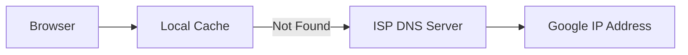

---

## Simple Explanation

DNS is like a phonebook:

| Domain Name  | IP Address  |
| ------------ | ----------- |
| google.com   | 8.8.8.8     |
| facebook.com | xx.xx.xx.xx |

---

## Why DNS Happens First

Imagine trying to send a package without knowing destination address.

Impossible.

So first:

✅ Resolve destination IP
Then:

✅ Start communication

---

# B. TCP Three-Way Handshake

Before sending data:

Your laptop asks:

> “Hey server, are you ready?”

Server replies:

> “Yes, I’m ready.”

---

# Three-Way Handshake

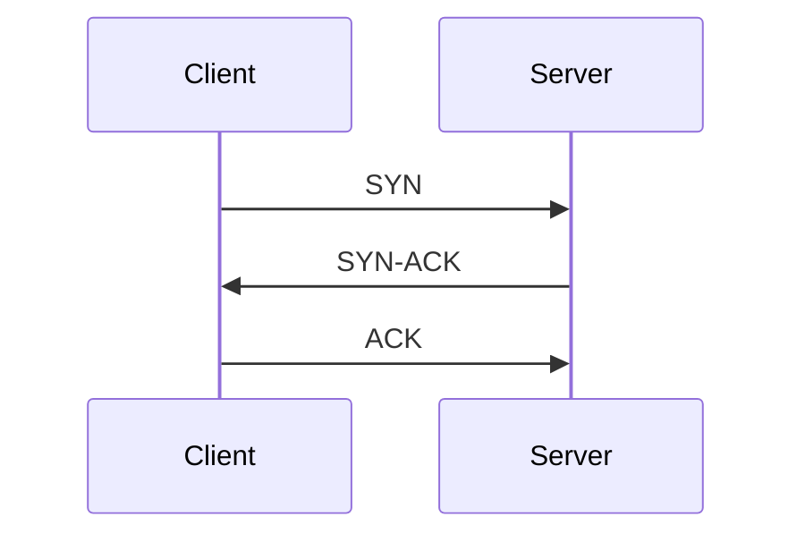

---

# Meaning

| Step    | Meaning                |
| ------- | ---------------------- |
| SYN     | Start communication    |
| SYN-ACK | Server agrees          |
| ACK     | Connection established |

---

# Why Handshake is Needed

Without checking:

* Server may be unavailable
* Server may reject request
* Resources may be wasted

---

# 5. OSI Model Overview

# 7 Layers of OSI Model

| Layer | Name         | Main Function              |
| ----- | ------------ | -------------------------- |
| 7     | Application  | User interaction           |
| 6     | Presentation | Encryption/Formatting      |
| 5     | Session      | Session management         |
| 4     | Transport    | Segmentation & reliability |
| 3     | Network      | Routing/IP                 |
| 2     | Data Link    | MAC address/frame          |
| 1     | Physical     | Electrical signals         |

---

# Complete Diagram

```text
+-------------------+
| 7 Application     |
+-------------------+
| 6 Presentation    |
+-------------------+
| 5 Session         |
+-------------------+
| 4 Transport       |
+-------------------+
| 3 Network         |
+-------------------+
| 2 Data Link       |
+-------------------+
| 1 Physical        |
+-------------------+
```

---

# 6. Detailed Explanation of Each Layer

---

# Layer 7 — Application Layer

## Purpose

This is where communication starts.

Applications like:

* Browser
* Email client
* FTP client

interact with network services.

---

# What Happens Here

Your browser creates:

```http
HTTPS Request
```

Example:

```http
GET / HTTP/1.1
Host: google.com
```

---

# Common Protocols

| Protocol   | Purpose         |
| ---------- | --------------- |
| HTTP/HTTPS | Web browsing    |
| FTP        | File transfer   |
| SMTP       | Email           |
| DNS        | Name resolution |

---

# Real Example

When you type:

```text
https://google.com
```

Browser creates HTTP request at Layer 7.

---

# Diagram

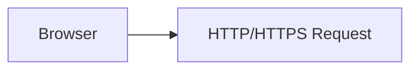

---

# Layer 6 — Presentation Layer

## Purpose

Responsible for:

* Encryption
* Formatting
* Compression

---

# Main Job

Converts data into readable/transmittable format.

---

# HTTPS Encryption

If using HTTPS:

```text
Plain Text --> Encrypted Text
```

---

# Why Encryption?

Data passes through many routers.

Without encryption:

❌ Anyone can read your data

With encryption:

✅ Data stays secure

---

# Diagram

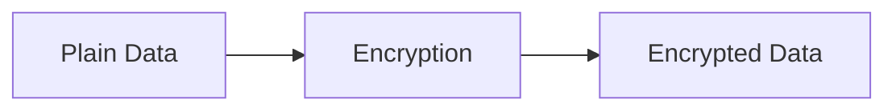

---

# Common Technologies

| Technology | Purpose            |
| ---------- | ------------------ |
| SSL/TLS    | Encryption         |
| JPEG       | Image formatting   |
| ASCII      | Character encoding |

---

# Layer 5 — Session Layer

## Purpose

Creates and maintains sessions.

---

# What is a Session?

A temporary conversation between:

```text
Client <--> Server
```

---

# Example

You login to Facebook.

Even after opening multiple pages:

✅ You remain logged in.

Why?

Because session is maintained.

---

# Session Responsibilities

* Session creation
* Session maintenance
* Session termination

---

# Browser Cookies

Sessions are commonly stored using:

* Cookies
* Cache

---

# Diagram

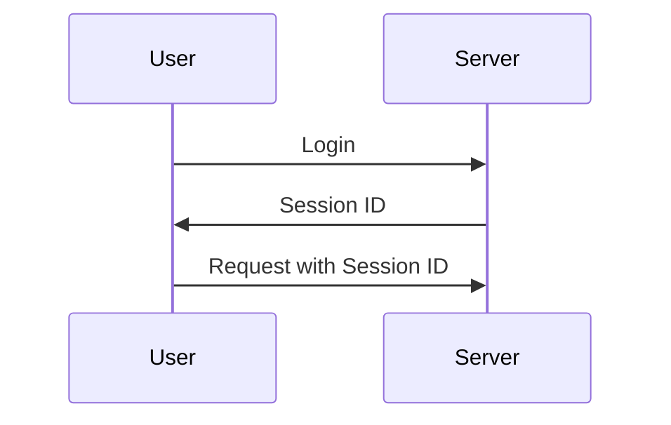

---

# Layers Managed by Browser

Very Important:

| Layer | Managed By |
| ----- | ---------- |
| 7     | Browser    |
| 6     | Browser    |
| 5     | Browser    |

---

# Layer 4 — Transport Layer

## Purpose

Responsible for:

* Data segmentation
* Reliability
* Protocol selection

---

# Segmentation

Large data is broken into smaller parts.

Example:

```text
10GB file
```

becomes:

```text
Small chunks/segments
```

---

# Why Segmentation?

Smaller pieces:

✅ Travel faster
✅ Easier to retransmit
✅ More reliable

---

# Protocols Used

| Protocol | Features            |
| -------- | ------------------- |
| TCP      | Reliable            |
| UDP      | Fast but unreliable |

---

# TCP vs UDP

| Feature          | TCP  | UDP              |
| ---------------- | ---- | ---------------- |
| Reliable         | Yes  | No               |
| Ordered delivery | Yes  | No               |
| Faster           | No   | Yes              |
| Used in          | HTTP | Streaming/Gaming |

---

# Diagram

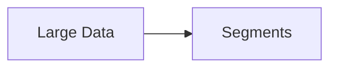

---

# Layer 3 — Network Layer

## Purpose

Responsible for:

* Routing
* Path selection
* IP addressing

---

# Main Job

Adds:

* Source IP
* Destination IP

---

# Data Unit

At Layer 3:

```text
Segments --> Packets
```

---

# Router Works Here

Routers decide:

> Which path should data take?

---

# Example

Like Google Maps finding shortest route.

---

# Diagram

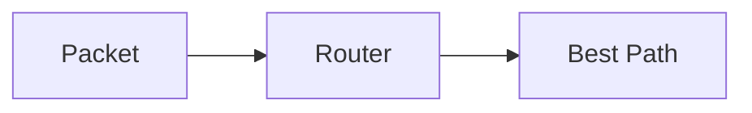

---

# Common Protocols

| Protocol | Purpose    |
| -------- | ---------- |
| IP       | Addressing |
| ICMP     | Ping       |
| OSPF     | Routing    |

---

# Layer 2 — Data Link Layer

## Purpose

Responsible for:

* Local network delivery
* MAC addressing
* Frames

---

# What Happens Here

Packets become:

```text
Frames
```

---

# MAC Address

Every network device has unique MAC address.

Example:

```text
00:1A:2B:3C:4D:5E
```

---

# Switch Works Here

Switches use MAC addresses to forward frames.

---

# Diagram

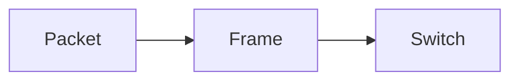

---

# Layer 1 — Physical Layer

## Purpose

Actual physical transmission.

---

# Converts Data Into

* Electrical signals
* Optical signals
* Radio waves

---

# Devices

| Device      | Function                 |
| ----------- | ------------------------ |
| Cable       | Transmission             |
| Fiber optic | High-speed communication |
| Hub         | Physical connection      |

---

# Diagram

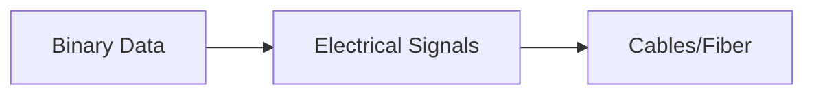

---

# 7. Complete End-to-End Data Flow

# Sending Data

```text
Application
    ↓
Presentation
    ↓
Session
    ↓
Transport
    ↓
Network
    ↓
Data Link
    ↓
Physical
```

---

# Receiving Data

Receiver processes in reverse:

```text
Physical
    ↑
Data Link
    ↑
Network
    ↑
Transport
    ↑
Session
    ↑
Presentation
    ↑
Application
```

---

# Full Journey Diagram

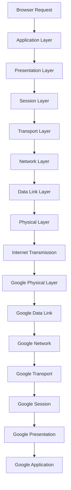

---

# 8. Encapsulation and Decapsulation

---

# Encapsulation

While sending data:

Each layer adds its own information.

---

# Visualization

```text
Data
 ↓
Segment
 ↓
Packet
 ↓
Frame
 ↓
Bits
```

---

# Decapsulation

Receiver removes layer-by-layer information.

```text
Bits
 ↑
Frame
 ↑
Packet
 ↑
Segment
 ↑
Data
```

---

# 9. TCP/IP Model vs OSI Model

---

# TCP/IP Model

Modern internet mainly uses TCP/IP model.

---

# Mapping

| OSI          | TCP/IP         |
| ------------ | -------------- |
| Application  | Application    |
| Presentation | Application    |
| Session      | Application    |
| Transport    | Transport      |
| Network      | Internet       |
| Data Link    | Network Access |
| Physical     | Network Access |

---

# Main Difference

OSI has:

```text
7 layers
```

TCP/IP has:

```text
4 layers
```

---

# Diagram

```text
OSI                  TCP/IP

Application   ┐
Presentation  ├──> Application
Session       ┘

Transport  --------> Transport

Network    --------> Internet

Data Link  ┐
Physical   ┘-------> Network Access
```

---

# 10. Important Interview Notes

---

# Devices and Layers

| Device   | OSI Layer |
| -------- | --------- |
| Hub      | Layer 1   |
| Switch   | Layer 2   |
| Router   | Layer 3   |
| Firewall | Layer 3/4 |
| Browser  | Layer 7   |

---

# Data Names at Each Layer

| Layer | Data Name |
| ----- | --------- |
| 7-5   | Data      |
| 4     | Segment   |
| 3     | Packet    |
| 2     | Frame     |
| 1     | Bits      |

---

# Important Protocols

| Layer | Protocols        |
| ----- | ---------------- |
| 7     | HTTP, HTTPS, FTP |
| 4     | TCP, UDP         |
| 3     | IP, ICMP         |
| 2     | Ethernet         |

---

# 11. Memory Tricks

---

# OSI Layer Order (Top to Bottom)

```text
All People Seem To Need Data Processing
```

| Word       | Layer        |
| ---------- | ------------ |
| All        | Application  |
| People     | Presentation |
| Seem       | Session      |
| To         | Transport    |
| Need       | Network      |
| Data       | Data Link    |
| Processing | Physical     |

---

# Reverse Order

```text
Please Do Not Throw Sausage Pizza Away
```

| Word    | Layer        |
| ------- | ------------ |
| Please  | Physical     |
| Do      | Data Link    |
| Not     | Network      |
| Throw   | Transport    |
| Sausage | Session      |
| Pizza   | Presentation |
| Away    | Application  |

---

# 12. Summary Tables

---

# OSI Layer Summary

| Layer | Name         | Main Function | Device/Protocol |
| ----- | ------------ | ------------- | --------------- |
| 7     | Application  | User services | HTTP            |
| 6     | Presentation | Encryption    | SSL/TLS         |
| 5     | Session      | Session mgmt  | Cookies         |
| 4     | Transport    | Segmentation  | TCP/UDP         |
| 3     | Network      | Routing       | Router/IP       |
| 2     | Data Link    | MAC/Frames    | Switch          |
| 1     | Physical     | Signals       | Fiber/Cable     |

---

# Full Transformation of Data

| Layer        | Transformation   |
| ------------ | ---------------- |
| Application  | HTTP Request     |
| Presentation | Encryption       |
| Session      | Session Creation |
| Transport    | Segments         |
| Network      | Packets          |
| Data Link    | Frames           |
| Physical     | Bits/Signals     |

---

# 13. Practical DevOps Perspective

---

# Do DevOps Engineers Need Deep OSI Knowledge?

Usually:

❌ Not deep packet-level networking

But:

✅ Strong high-level understanding is VERY important.

---

# Why DevOps Engineers Should Know OSI

Because troubleshooting often involves:

* DNS issues
* SSL certificate problems
* Load balancer failures
* Firewall blocks
* Routing issues
* TCP connectivity issues

---

# Real DevOps Examples

| Problem            | OSI Layer |
| ------------------ | --------- |
| DNS failure        | Layer 7   |
| SSL issue          | Layer 6   |
| Session timeout    | Layer 5   |
| Port blocked       | Layer 4   |
| Routing issue      | Layer 3   |
| Switch/VLAN issue  | Layer 2   |
| Cable disconnected | Layer 1   |

---

# Final End-to-End Visualization

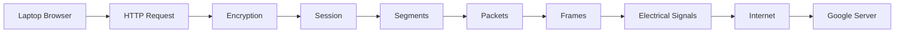

---

# Final Quick Revision

| Layer | Core Idea        |
| ----- | ---------------- |
| 7     | Create request   |
| 6     | Encrypt data     |
| 5     | Maintain session |
| 4     | Split data       |
| 3     | Add IP           |
| 2     | Add MAC          |
| 1     | Send signals     |

---

# Key Takeaway

The OSI model is a conceptual framework that explains:

✅ How data moves
✅ How devices communicate
✅ How protocols work together
✅ How internet communication becomes possible

Understanding OSI means understanding the foundation of networking itself.
