# Python for DevOps — Day 0 Complete Notes

## Course Syllabus, Roadmap & Learning Strategy

Based on: Abhishek Veeramalla’s *Python for DevOps* playlist introduction.

---

# Table of Contents

1. Introduction to the Course
2. Why This Course is Different
3. Course Objectives
4. Prerequisites
5. Learning Methodology
6. GitHub Repository Structure
7. Complete 19-Day Roadmap
8. Detailed Topic Breakdown
9. Python Concepts Explained
10. DevOps Perspective of Python
11. Libraries Important for DevOps Engineers
12. Interview Preparation Strategy
13. Learning Flow Diagram
14. Recommended Tools
15. Final Takeaways

---

# 1. Introduction to the Course

This course is designed specifically for **DevOps Engineers** who want to learn Python from scratch.

Unlike generic Python courses, this series focuses on:

* Real-world DevOps automation
* Infrastructure scripting
* API interaction
* Cloud automation
* Configuration management
* Interview preparation
* Practical examples

---

# 2. Why This Course is Different

Most Python courses teach Python as a general-purpose programming language.

This course teaches:

```text
Python → Through the DevOps Mindset
```

Meaning:

| Traditional Python Courses | Python for DevOps           |
| -------------------------- | --------------------------- |
| General programming        | Infrastructure automation   |
| Academic examples          | Real-world DevOps examples  |
| Theory heavy               | Practical automation        |
| Focus on software apps     | Focus on servers/cloud/APIs |
| Generic libraries          | DevOps-specific libraries   |

---

# 3. Course Objectives

By the end of this 19-day roadmap, learners will be able to:

* Understand Python fundamentals
* Write automation scripts
* Work with APIs
* Handle JSON/YAML
* Use environment variables
* Create cron jobs
* Automate cloud tasks
* Use Python libraries for DevOps
* Solve interview questions

---

# 4. Prerequisites

## Only ONE prerequisite

> Read the complete syllabus before starting.

That’s it.

No prior Python experience required.

---

# 5. Learning Methodology

The instructor emphasizes:

## Structured Learning

Instead of randomly learning topics:

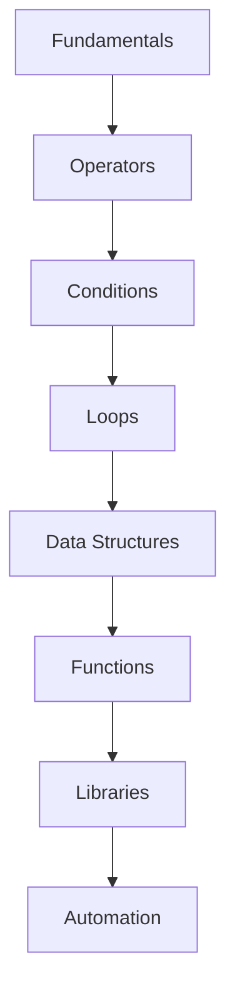

This structured progression prevents confusion.

---

# 6. GitHub Repository Structure

The course maintains a dedicated GitHub repository.

## Folder Structure

```text
python-for-devops/
│
├── Day-1/
├── Day-2/
├── Day-3/
├── ...
├── Day-19/
```

Each folder may contain:

* Notes
* Practice files
* Assignments
* Interview questions
* Code samples
* Projects

---

# 7. Complete 19-Day Roadmap

# Full Course Timeline

| Day    | Topic                                 |
| ------ | ------------------------------------- |
| Day 1  | Python Introduction & Installation    |
| Day 2  | Strings & Numbers                     |
| Day 3  | Variables                             |
| Day 4  | Functions, Modules & Packages         |
| Day 5  | Environment Variables & CLI Arguments |
| Day 6  | Operators                             |
| Day 7  | Conditional Statements                |
| Day 8  | Lists Part 1                          |
| Day 9  | Loops                                 |
| Day 10 | Lists Part 2                          |
| Day 11 | Dictionaries & Sets                   |
| Day 12 | Functions Deep Dive                   |
| Day 13 | Modules Advanced                      |
| Day 14 | Lambda Functions & Recursion          |
| Day 15 | Python Libraries for DevOps           |
| Day 16 | REST APIs with Python                 |
| Day 17 | Data Serialization (JSON/YAML)        |
| Day 18 | Cron Jobs Automation                  |
| Day 19 | Python Interview Questions            |

---

# 8. Detailed Topic Breakdown

# Day 1 — Python Introduction

## Topics Covered

* Python history
* Python 2 vs Python 3
* Installing Python
* GitHub Codespaces
* IDE Setup
* First Python Program

---

## Python Installation Platforms

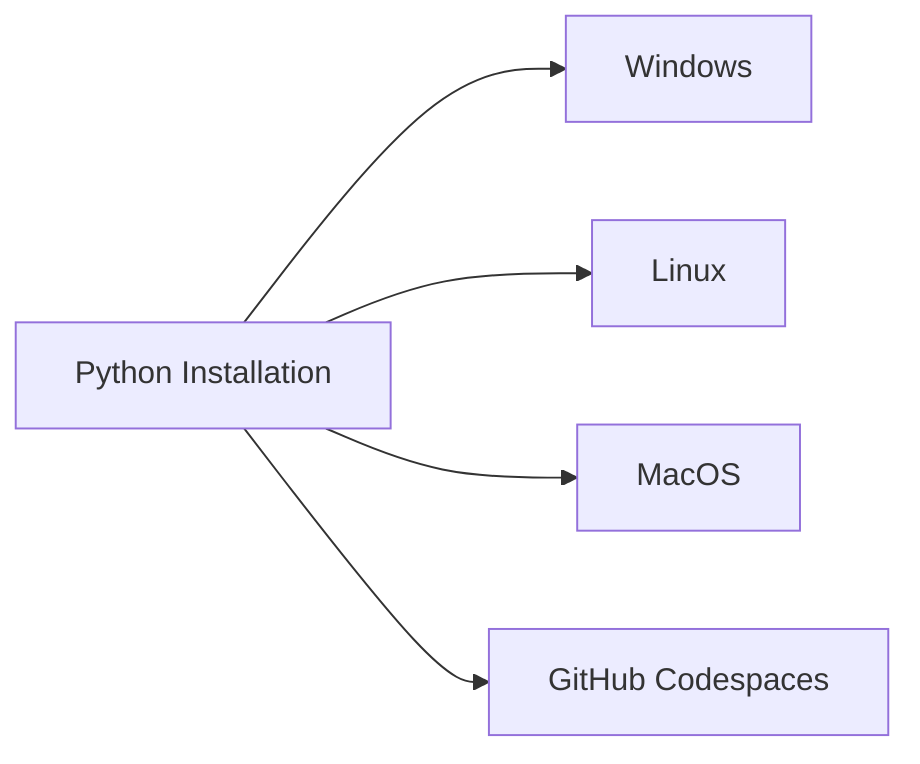

---

## IDEs Mentioned

| IDE     | Purpose                 |
| ------- | ----------------------- |
| VS Code | Lightweight development |
| PyCharm | Professional Python IDE |

---

## First Program

```python
print("Hello World")
```

Purpose:

* Verify installation
* Verify configuration
* Understand execution flow

---

# Day 2 — Strings & Numbers

## Topics

* String datatype
* Integer datatype
* Float datatype
* String formatting
* String manipulation
* Regular expressions

---

## String Manipulation

Examples:

```python
name = "DevOps"
print(name.upper())
print(name.lower())
```

---

## String Formatting

```python
name = "Abhishek"
print(f"Hello {name}")
```

---

## Importance in Interviews

Many Python interview questions involve:

* String reversal
* String comparison
* Pattern matching
* Parsing logs

---

# Day 3 — Variables

## Variable Basics

Variables store data.

```python
server = "production"
cpu = 8
```

---

# Dynamic Typing in Python

Python is dynamically typed.

```python
x = 10
x = "hello"
```

No datatype declaration needed.

---

## Variable Scope

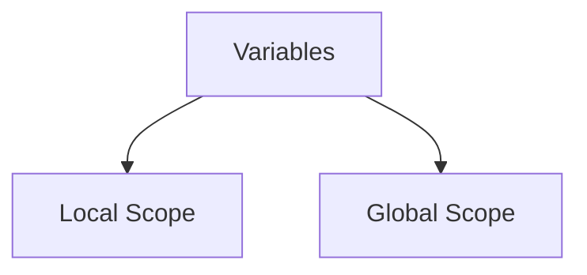

---

## Best Practices

| Good Practice        | Example       |
| -------------------- | ------------- |
| Use meaningful names | `server_name` |
| Avoid short names    | `x`, `y`      |
| Use snake_case       | `cpu_usage`   |

---

# Day 4 — Functions, Modules & Packages

---

# Functions

Functions help reuse code.

```python
def greet():
    print("Hello")
```

---

# Modules

A module is a Python file.

```text
math.py
utils.py
```

---

# Packages

A package contains multiple modules.

```text
package/
│
├── module1.py
├── module2.py
└── __init__.py
```

---

# Virtual Environments

One of the MOST IMPORTANT topics.

## Why Needed?

Avoid dependency conflicts.

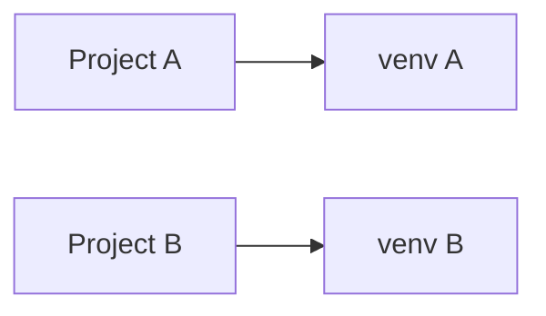

---

# Day 5 — Environment Variables & CLI Arguments

---

# Environment Variables

Used heavily in DevOps.

Example:

```bash
export AWS_REGION=us-east-1
```

Python:

```python
import os
print(os.getenv("AWS_REGION"))
```

---

# Command Line Arguments

```python
import sys
print(sys.argv)
```

---

## Real DevOps Usage

| Use Case    | Example                |
| ----------- | ---------------------- |
| Credentials | API keys               |
| Deployment  | Environment selection  |
| Automation  | Passing runtime values |

---

# Day 6 — Operators

---

# Types of Operators

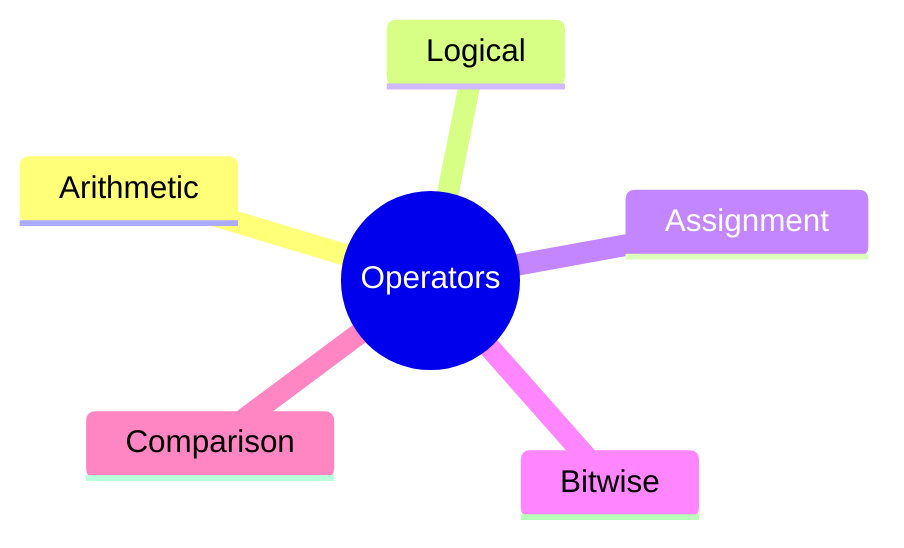

---

# Arithmetic Operators

a+b,\ a-b,\ a\times b,\ \frac{a}{b}

---

# Logical Operators

| Operator | Meaning              |
| -------- | -------------------- |
| and      | Both conditions true |
| or       | One condition true   |
| not      | Reverse condition    |

---

# Importance

Operators are the foundation of:

* Conditions
* Loops
* Automation logic
* Infrastructure scripting

---

# Day 7 — Conditional Statements

---

# If-Else Structure

```python
if cpu > 80:
    print("High CPU")
else:
    print("Normal")
```

---

# Decision Flow

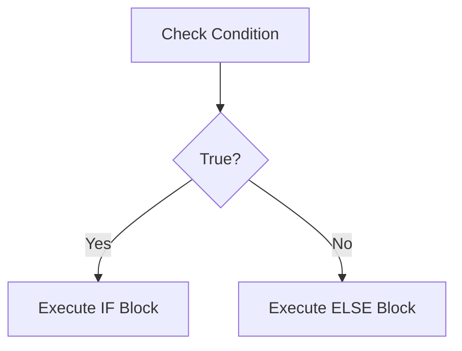

---

# Real DevOps Example

* Auto-scaling decisions
* Health monitoring
* Deployment conditions

---

# Day 8 — Lists Part 1

---

# Lists in Python

```python
servers = ["web1", "web2", "web3"]
```

---

# List Operations

| Operation | Example            |
| --------- | ------------------ |
| Access    | `servers[0]`       |
| Append    | `servers.append()` |
| Remove    | `servers.remove()` |

---

# Day 9 — Loops

---

# Loop Types

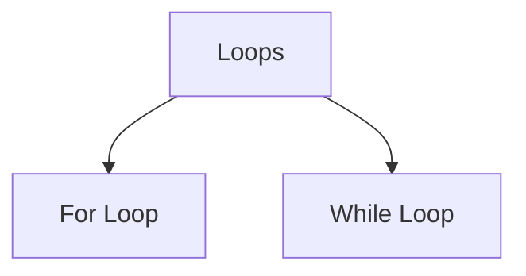

---

# Example

```python
for server in servers:
    print(server)
```

---

# Loop Control Statements

| Statement | Purpose        |
| --------- | -------------- |
| break     | Stop loop      |
| continue  | Skip iteration |

---

# DevOps Relevance

Loops help automate:

* Multiple server operations
* Batch deployments
* Monitoring systems

---

# Day 10 — Lists Part 2

Advanced concepts:

* Nested lists
* List comprehensions
* Interview questions

---

# List Comprehension

```python
nums = [x*x for x in range(5)]
```

---

# Day 11 — Dictionaries & Sets

---

# Dictionaries

Key-value storage.

```python
server = {
    "name": "web1",
    "ip": "10.0.0.1"
}
```

---

# Sets

Store unique values.

```python
regions = {"us-east-1", "us-west-1"}
```

---

# Day 12 & 13 — Functions & Modules Deep Dive

Advanced topics:

* Function arguments
* Return values
* Reusable code
* Modular programming

---

# Why Important for DevOps?

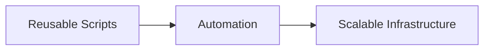

---

# Day 14 — Lambda & Recursion

---

# Lambda Functions

Anonymous functions.

```python
square = lambda x: x*x
```

---

# Recursion

Function calling itself.

```python
def factorial(n):
    if n == 1:
        return 1
    return n * factorial(n-1)
```

---

# Day 15 — Python Libraries for DevOps

---

# Important Libraries

| Library  | Purpose          |
| -------- | ---------------- |
| Paramiko | SSH automation   |
| Fabric   | Remote execution |
| boto3    | AWS automation   |
| requests | API calls        |

---

# DevOps Automation Flow

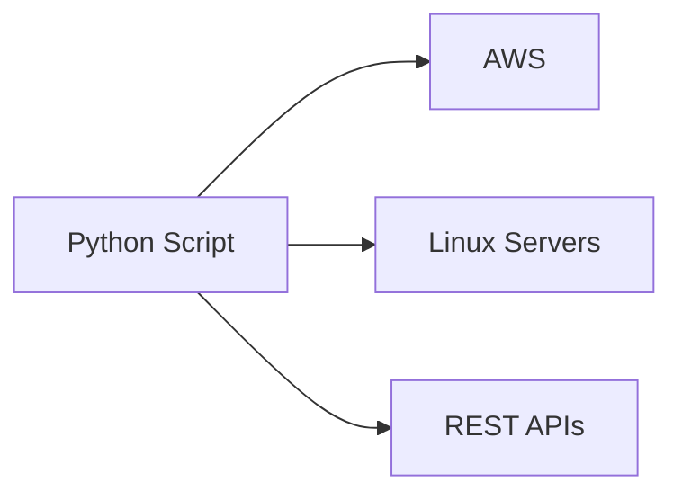

---

# Day 16 — REST APIs

---

# API Workflow

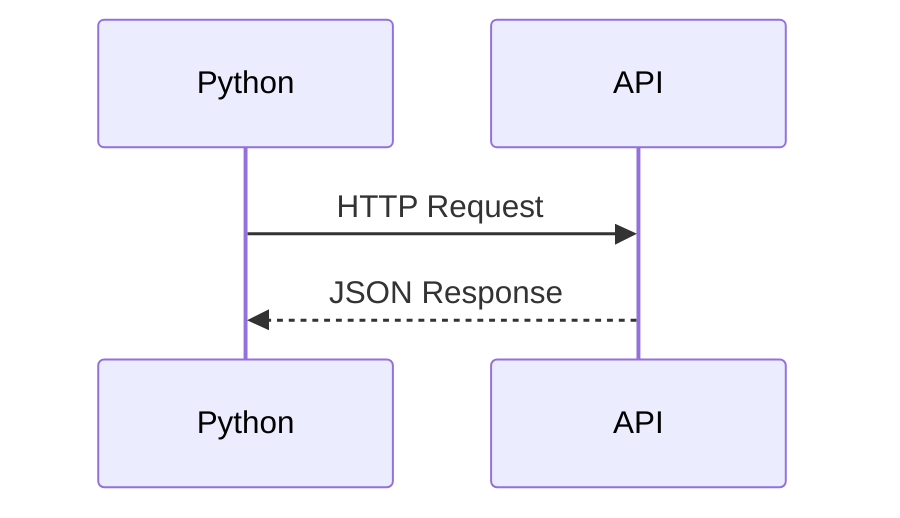

---

# Requests Module

```python
import requests

response = requests.get("https://api.example.com")
print(response.json())
```

---

# JSON to Dictionary

```python
data = response.json()
print(data["name"])
```

---

# Day 17 — JSON & YAML

---

# Data Serialization

Converting data formats.

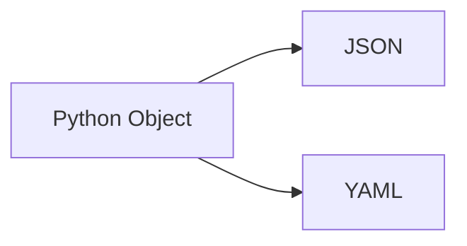

---

# JSON Example

```json
{
  "name": "devops"
}
```

---

# YAML Example

```yaml
name: devops
```

---

# Importance in DevOps

Used in:

* Kubernetes
* Ansible
* CI/CD pipelines
* Terraform

---

# Day 18 — Cron Jobs

---

# Cron Job Automation

```bash
* * * * * python backup.py
```

---

# Cron Architecture

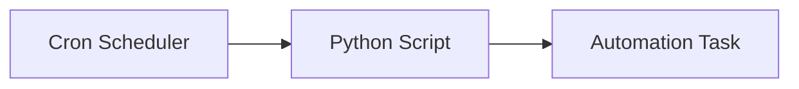

---

# Real DevOps Usage

* Backups
* Monitoring
* Cleanup jobs
* Health checks

---

# Day 19 — Interview Preparation

Topics include:

* Python interview questions
* Coding questions
* DevOps scenarios
* Automation examples

---

# 9. Python Concepts Explained

# Core Pillars of Python

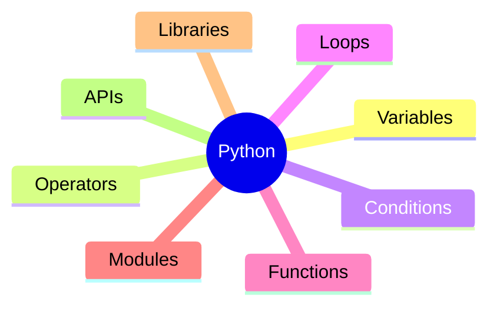

---

# 10. DevOps Perspective of Python

---

# Why DevOps Engineers Need Python

| DevOps Task       | Python Usage |
| ----------------- | ------------ |
| Cloud automation  | boto3        |
| Server management | Paramiko     |
| CI/CD             | Scripting    |
| Monitoring        | APIs         |
| Infrastructure    | Automation   |

---

# Typical DevOps Automation Lifecycle

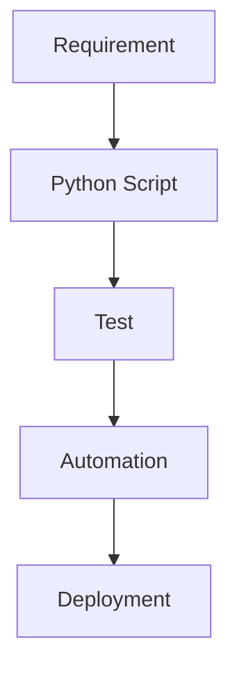

---

# 11. Libraries Important for DevOps Engineers

# Paramiko

SSH automation.

```python
import paramiko
```

Used for:

* Remote commands
* Server administration

---

# boto3

AWS SDK for Python.

```python
import boto3
```

Used for:

* EC2
* S3
* IAM
* Lambda

---

# requests

API interaction.

```python
import requests
```

---

# 12. Interview Preparation Strategy

The course repeatedly emphasizes:

## Learn to Write Code During Interviews

Interviewers evaluate:

* Logic
* Variable naming
* Code structure
* Reusability
* Problem solving

---

# Important Interview Areas

| Topic      | Priority  |
| ---------- | --------- |
| Strings    | High      |
| Lists      | High      |
| Loops      | High      |
| Functions  | Very High |
| APIs       | High      |
| Automation | Very High |

---

# 13. Learning Flow Diagram

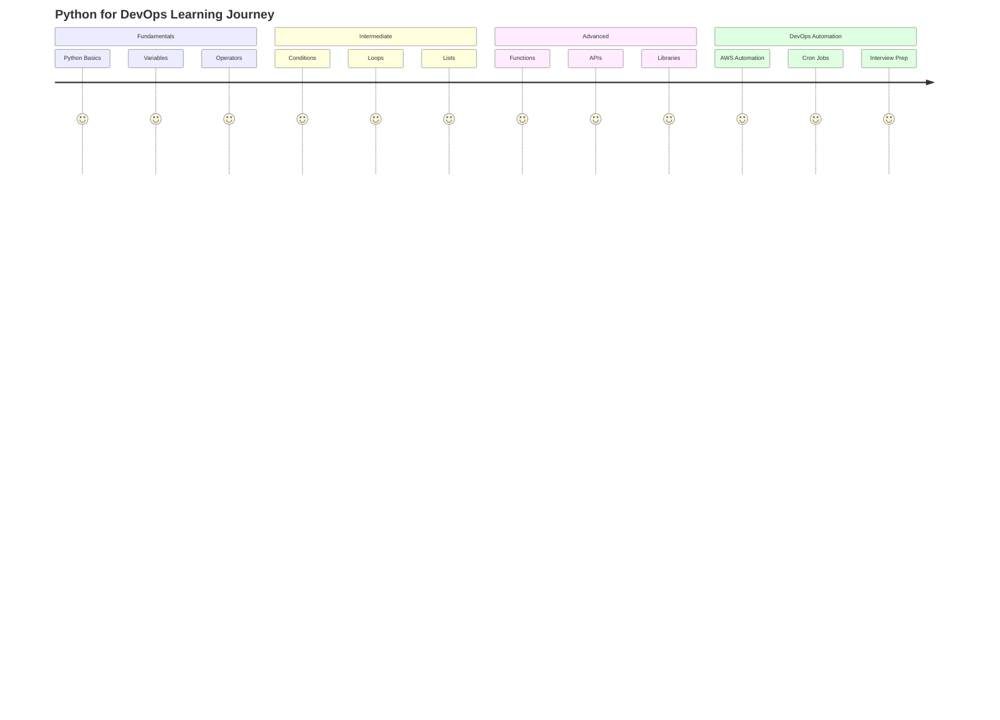

---

# 14. Recommended Tools

| Tool              | Purpose              |
| ----------------- | -------------------- |
| Python            | Programming language |
| VS Code           | IDE                  |
| GitHub Codespaces | Cloud development    |
| GitHub            | Version control      |
| Linux Terminal    | Automation           |

---

# 15. Final Takeaways

## Key Highlights

* Structured 19-day roadmap
* DevOps-focused Python learning
* Practical examples
* Real automation scenarios
* Interview-oriented approach

---

# Most Important Message from the Instructor

> Learn Python not as a developer alone, but as a DevOps Engineer who automates infrastructure, APIs, servers, and cloud systems.

---

# Suggested Learning Strategy

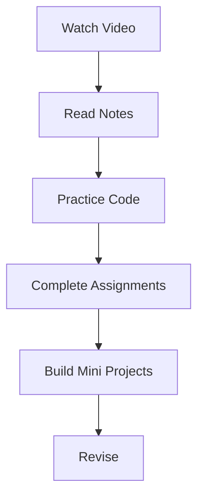

---

# Recommended Daily Routine

| Activity           | Time    |
| ------------------ | ------- |
| Watch lecture      | 1 hour  |
| Practice coding    | 2 hours |
| Read documentation | 30 mins |
| Revise notes       | 30 mins |

---

# Conclusion

This Python for DevOps roadmap is highly structured and practical.

It prepares learners for:

* DevOps automation
* Cloud scripting
* Real-world infrastructure tasks
* Technical interviews
* Production-level Python usage

The syllabus progression is intentionally designed to:

```text
Build Fundamentals → Practice Logic → Learn Automation → Apply in DevOps
```

---

# End of Notes 🚀
