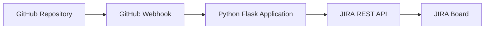
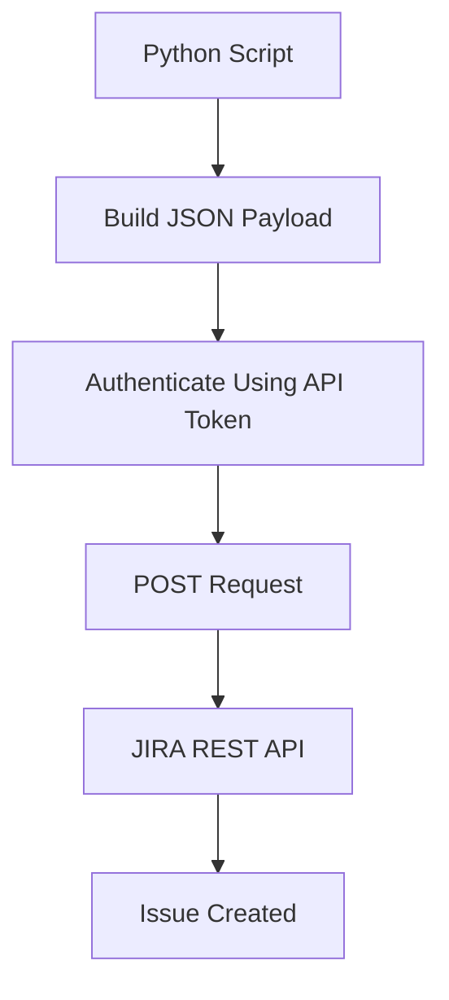

# 🚀 Day 14 – Python for DevOps

# Automate JIRA Ticket Creation from GitHub Events using Python

---

# 📌 Project Overview

This project demonstrates a **real-world DevOps automation use case** where a JIRA ticket is automatically created whenever a developer validates a GitHub issue and posts a specific comment (e.g., `slj`).

Instead of manually:

1. Opening JIRA
2. Navigating to the backlog
3. Creating a ticket
4. Copying issue details

Developers can simply comment on a GitHub issue, and automation handles the rest.

---

# 🎯 Business Problem Statement

In large organizations:

* QA Engineers report bugs.
* Developers review and triage these bugs.
* Valid bugs must be tracked in JIRA.

### Existing Manual Process

```text
QA Engineer
      │
      ▼
Creates GitHub Issue
      │
      ▼
Developer Reviews
      │
      ▼
Valid Bug?
      │
      ▼
Open JIRA
      │
      ▼
Create Ticket Manually
      │
      ▼
Copy/Paste Details
```

### Problems

❌ Time-consuming

❌ Repetitive work

❌ Human errors

❌ Reduced developer productivity

---

# ✅ Automated Solution

```text
QA Engineer
      │
      ▼
Creates GitHub Issue
      │
      ▼
Developer Reviews
      │
      ▼
Comments "slj"
      │
      ▼
GitHub Webhook
      │
      ▼
Python Application
      │
      ▼
JIRA API
      │
      ▼
JIRA Ticket Created Automatically
```

---

# 🏗️ High-Level Architecture



---

# 🔥 What Happens Behind the Scenes?

When a developer comments:

```text
slj
```

GitHub:

1. Detects the comment
2. Triggers a webhook
3. Sends issue information as JSON

Example:

```json
{
  "issue": {
    "title": "Order Flow Broken",
    "description": "Checkout failing"
  },
  "comment": {
    "body": "slj"
  }
}
```

Python application:

* Receives JSON
* Extracts issue details
* Calls JIRA API
* Creates JIRA ticket

---

# 📚 Project Breakdown

The complete solution is divided into two parts.

---

## Part 1

Focus:

* JIRA Setup
* API Authentication
* Understanding JIRA APIs
* Python Script Development

```text
JIRA Setup
      │
      ▼
Generate API Token
      │
      ▼
Understand JIRA APIs
      │
      ▼
Write Python Script
      │
      ▼
Create JIRA Ticket
```

---

## Part 2

Focus:

* Flask Application
* Hosting on EC2
* GitHub Webhooks

```text
Python Script
      │
      ▼
Convert to Flask App
      │
      ▼
Deploy on EC2
      │
      ▼
Configure GitHub Webhook
      │
      ▼
End-to-End Automation
```

---

# 🛠️ Step 1: JIRA Setup

Visit:

```text
https://www.atlassian.com/software/jira
```

Create:

* Atlassian Account
* JIRA Software Project
* Scrum Board

---

## Create Project

Example:

```text
Project Name: Abhishek
Project Key : AB
```

Result:

```text
AB
 ├── Backlog
 ├── Stories
 ├── Tasks
 └── Bugs
```

---

# 🔐 Step 2: Generate JIRA API Token

Why?

When using APIs, username/password is not recommended.

Instead:

```text
Email + API Token
```

are used for authentication.

---

## Generate Token

Navigate:

```text
Profile
   │
   ▼
Manage Account
   │
   ▼
Security
   │
   ▼
API Tokens
   │
   ▼
Create Token
```

Example:

```text
Token Name: python
```

---

# 🌐 Step 3: Understanding JIRA REST APIs

JIRA exposes REST APIs for:

| Operation    | API    |
| ------------ | ------ |
| Get Projects | GET    |
| Create Issue | POST   |
| Update Issue | PUT    |
| Delete Issue | DELETE |
| Add Comments | POST   |

---

# 📖 JIRA API Documentation

Search:

```text
JIRA REST API Documentation
```

Benefits:

✅ Ready-made examples

✅ Python snippets

✅ Java snippets

✅ NodeJS snippets

✅ Shell examples

---

# Example 1: List All Projects

Goal:

Retrieve all projects available in JIRA.

---

## Required Modules

```python
import requests
import json

from requests.auth import HTTPBasicAuth
```

---

## Authentication

```python
auth = HTTPBasicAuth(
    "email@example.com",
    "API_TOKEN"
)
```

---

## API Request

```python
response = requests.request(
    "GET",
    url,
    headers=headers,
    auth=auth
)
```

---

# JSON Response Structure

JIRA returns:

```python
[
   {
      "id":"10001",
      "name":"Abhishek"
   },

   {
      "id":"10002",
      "name":"My Scrum Project"
   }
]
```

---

# Understanding the Data Structure

```text
List
 │
 ├── Element 0
 │      └── Project
 │
 └── Element 1
        └── Project
```

---

# Extracting Project Name

```python
output = json.loads(response.text)

name = output[0]["name"]

print(name)
```

Output:

```text
Abhishek
```

---

# Printing All Projects

```python
for project in output:
    print(project["name"])
```

Output:

```text
Abhishek
My Scrum Project
```

---

# Important Python Concepts Used

## requests Module

Used for:

```text
HTTP Communication
```

Supports:

* GET
* POST
* PUT
* DELETE

---

## json Module

Used to convert:

```text
JSON
   ▼
Python Dictionary
```

Using:

```python
json.loads()
```

---

# Step 4: Create a JIRA Ticket

Goal:

Create a ticket programmatically.

---

## API Type

```text
POST
```

Because we are creating data.

---

# Understanding Required Fields

JIRA supports many fields.

Example:

```text
Project
Issue Type
Summary
Description
Priority
Reporter
Labels
Versions
Assignee
Components
Custom Fields
```

---

# Mandatory Fields

Only three are essential:

| Field      | Mandatory |
| ---------- | --------- |
| Project    | Yes       |
| Issue Type | Yes       |
| Summary    | Yes       |

Description is strongly recommended.

---

# Minimal Payload

```json
{
  "project": {
      "key": "AB"
  },

  "issuetype": {
      "id": "10001"
  },

  "summary": "First JIRA Ticket",

  "description": "My First JIRA Ticket"
}
```

---

# Finding Issue Type ID

Navigate:

```text
Board Settings
      │
      ▼
Issue Types
      │
      ▼
Story
      │
      ▼
Copy ID from URL
```

Example:

```text
Issue Type ID = 10001
```

---

# Create Issue Flow



---

# Script Execution

```bash
python create_jira.py
```

Output:

```text
Issue Created Successfully
```

---

# JIRA Backlog

Before:

```text
AB-13
```

After Script:

```text
AB-13
AB-14
```

New Ticket:

```text
AB-14
First JIRA Ticket
```

---

# Why This Project Matters for DevOps Engineers

This project teaches:

### Python

* Requests Module
* JSON Handling
* Authentication

### APIs

* REST APIs
* HTTP Methods
* Payload Construction

### DevOps Concepts

* Automation
* Webhooks
* Integration
* Event Driven Architecture

### Real Industry Usage

* GitHub ↔ JIRA Integration
* Incident Tracking
* Bug Tracking
* Workflow Automation

---

# Key Learning Outcomes

✅ Generate JIRA API Tokens

✅ Authenticate with REST APIs

✅ Understand JSON Responses

✅ Parse API Data using Python

✅ Create JIRA Issues Programmatically

✅ Build Real-World DevOps Automations

✅ Prepare for GitHub Webhook Integration

---

# Final Architecture (Complete Project)


---

# Summary

This project demonstrates how a DevOps Engineer can automate the creation of JIRA tickets directly from GitHub issue events.

The workflow leverages:

* GitHub Issues
* GitHub Webhooks
* Python Requests Library
* JIRA REST APIs
* API Token Authentication

By replacing manual ticket creation with automation, teams can improve efficiency, reduce repetitive work, and maintain better visibility into software defects and development tasks.

**Core Principle:**

> "Automate repetitive operational tasks so developers can focus on building software rather than managing tools."
